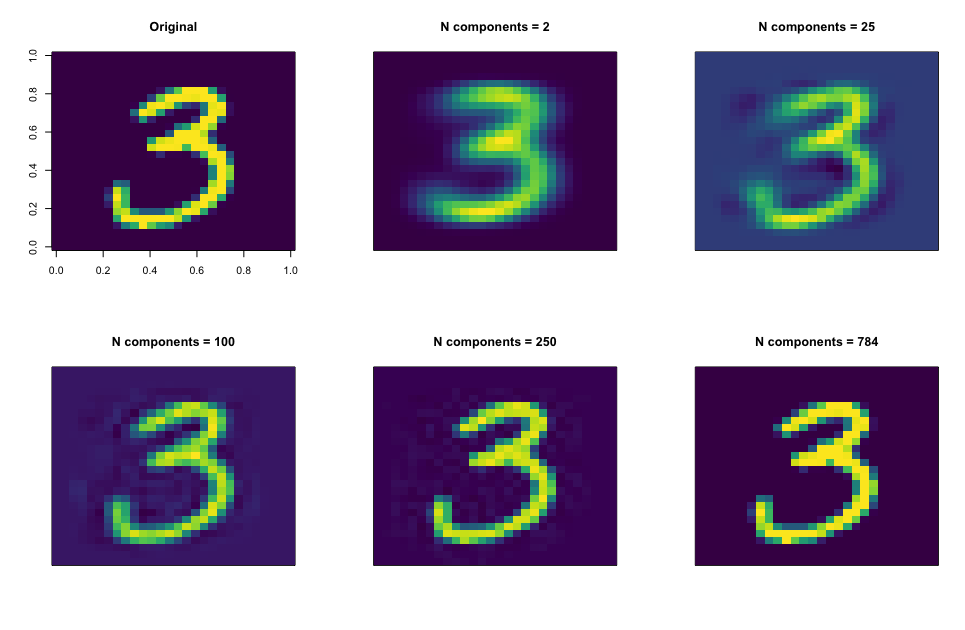
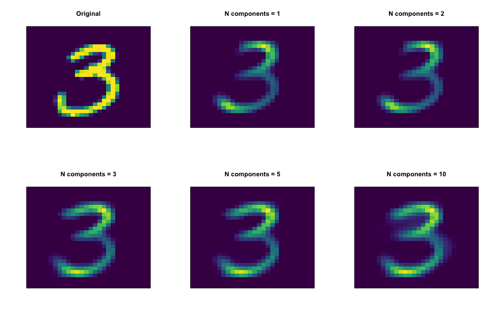
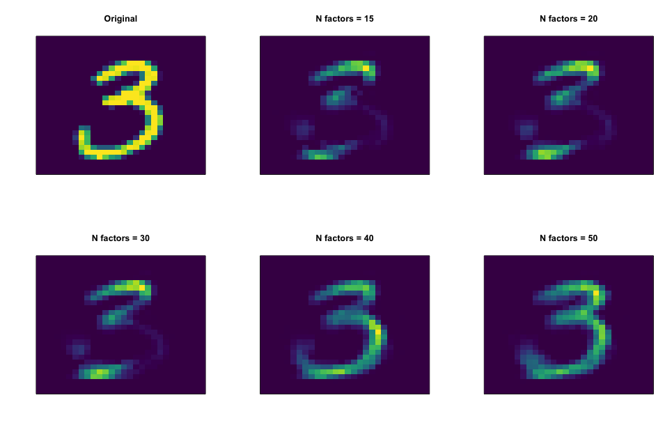

```{r setup, include=FALSE, cache=FALSE}
knitr::opts_chunk$set(echo = TRUE, comment=NA, message = FALSE, warning=FALSE, R.options=list(width=120), 
                      cache.rebuild=F, cache=TRUE,
                      fig.align='center', dev = 'svg', dev.args=list(bg = 'transparent'))
knitr::opts_knit$set(root.dir = '../')
library(tidyverse); library(htmltools); library(lazerhawk); library(heatR); library(pander); library(lavaan);
```

```{r pander_opts, echo=FALSE, results='hide'}
mapply(function(o, v) panderOptions(o, v),
       c('keep.trailing.zeros', 'round', 'table.split.table', 'table.split.cells'), 
       c(TRUE, 2, Inf, Inf))
```


## Introduction

Not everything we want to measure comes with an obvious yardstick.  If one wants to measure something like a person's happiness, what would they have at their disposal? 

- Are they smiling?
- Did they just get a pay raise?
- Are they interacting well with others?
- Are they relatively healthy?


Any of these might be useful as an *indicator* of their current state of happiness, but of course none of them would tell us whether they truly are happy or not. At best, they can be considered imperfect measures. If we consider those and other indicators collectively, perhaps we can get an underlying measure of something we might call happiness, contentment, or some other arbitrary but descriptive name.

The above describes a <span class="emph">latent variable</span>, and gives at least one sense of at least one way in which we can think of them. However, models incorporating latent variables are seen all over, and incorporated in many ways.  Broadly speaking, <span class='emph'>factor analysis</span> can be seen as a dimension reduction technique, or as an approach to  modeling measurement error and understanding underlying constructs, a means to understand large amounts of text, a way to make movie recommendations, and more.  


Some key ideas:

- **Dimension Reduction/Data compression**: Many times we simply have the goal of taking a whole lot of variables, reducing them to much fewer, but while retaining as much information about the originals as possible. 
- **Matrix Factorization**: Many techniques discussed below fall under the broad heading of <span class='emph'>matrix factorization</span>, which is a way to start with a matrix and decompose it into a product of multiple matrices.
- **Latent Linear Models**: Many if not all of those we discuss can be expressed as a (multivariate) linear model.
- **Measurement error**: Some techniques can be used to tell us how well a group of items measure what they are supposed to measure.

Each section will provide some suggested packages to serve as starting points for standard implementations, most with code demonstrations.  Just note that there will likely be several packages beyond those suggested that provide enhancements in a variety of fashion.  Almost all the data is available from R packages (`package::data`):

- `psych::bfi`
- `psych::ability`
- `lda::poliblog.documents`
- `datasets::UScitiesD`
- `datasets::faithful`
- `recommenderlab::MovieLense`
- `poLCA::election`

To load them load the package and type `data('datasetname')`, or otherwise `data('datasetname', package='pack')`. 

And while the MNIST data is available in various places, you can download the processed threes used in the demos [here](https://github.com/m-clark/sem/raw/master/data/threes_mnist.RData).

This document also makes use of the <span class="pack">tidyverse</span> family of packages, so you'll want to have at least <span class="pack">dplyr</span> loaded.  

This document is meant to be high level.  For more details preuse my document on [Graphical & Latent Variable Models](http://m-clark.github.io/sem/).  See also, fellow CSCAR consultant James Henderson's [recent slides](https://jbhender.github.io/DimensionReduction-06June2017.html) regarding PCA, factor analysis, and multidimensional scaling for a bit more technical detail and additional examples regarding those techniques.  For a more technical overview of many matrix factorization techniques, but with nice summary tables, see Singh & Gordon, [*A Unified View of Matrix Factorization Models*](http://www.cs.cmu.edu/~ggordon/singh-gordon-unified-factorization-ecml.pdf).


## Principal Components Analysis

We'll start with one of the most widely used techniques for dimension reduction. With <span class="emph">principal components analysis</span> (PCA), we seek to find orthogonal (i.e. uncorrelated) factors to maximize the variance accounted for by each factor.  For some data, $X$ is the $NxD$ matrix of $N$ observations of $D$ variables.  We decompose X into two matrices - $Z$ are the $N x L$ component scores where $L <= D$, while $W$ are the $DxL$ weights, typically referred to as the <span class="emph">factor loading</span> matrix.

$$X = ZW'$$

Each created component, or factor, accounts for respectively less of the variance in the original data.  So, while PCA returns the same number of components as there are columns in the original data, they big idea is that we want to use far fewer.  However, with all components, we could reconstruct the data exactly.

Take for example, the [MNIST data](http://yann.lecun.com/exdb/mnist/), which contains 28 by 28 pixel images of the digits 0-9.  If we unroll the data to 784 columns, each row represents a single digit, with each entry the [grayscale value](https://en.wikipedia.org/wiki/Grayscale).  We can see in the following how well we can reconstruct a digit via PCA.  Even with only two components we can get a sense of what we're looking at.  With all components, the reconstruction is perfect.




### Example

Let's see an example with more digestible results.  The following data contain 25 personality items regarding the [Big 5](https://en.wikipedia.org/wiki/Big_Five_personality_traits) scales. There are 2800 total subjects, and five categories of questions[^big5].

- agreeableness: a tendency to be compassionate and cooperative rather than suspicious and antagonistic towards others
- conscientiousness: a tendency to be organized and dependable, show self-discipline, planning
- openness to experience: appreciation for art, emotion, adventure, unusual ideas, curiosity, and variety of experience.
- extraversion:  energy, assertiveness, sociability and the tendency to seek stimulation in the company of others, and talkativeness.
- neuroticism:  prone to physiological stress, tendency to experience unpleasant emotions easily, such as anger, anxiety, depression, and vulnerability

We'll just look at part of this to keep things simple, namely the agreeableness and neuroticism items.

```{r data_cogab, echo=1:2}
library(psych)
bfi_trim = bfi %>% 
  select(matches('A[1-5]|N[1-5]'))
DT::datatable(bfi_trim[1:10,],
              rownames = F,
              options = list(dom='t', 
                             scrollX=T,
                             autoWidth=T,
                             columnDefs=list(list(width = '100px', targets='_all'),
                                             list(className = 'dt-center', targets = '_all'))),
              width='100%')
```

<br>


So let's do a PCA.  We'll look at two components, though remember that PCA technically returns as many components as there are variables. You're just seeing part of the results. Note that PCA almost universally requires you to <span class="emph">standardize</span> the data,  so that each variable has the same variance.  Otherwise you'll just get components reflecting the relative variances. In what follows the PCA is done on the correlation matrix, which amounts to the same thing.

```{r pc_cog, echo=-3}
pc = principal(bfi_trim, 2)
pc
p = ncol(bfi_trim)
```

First, focus on the portion of the output where it says `SS loadings` . The first line is the sum of the squared loadings[^eigen] for each  component (in this case where we are using a correlation matrix as the basis, summing across all `r p` possible components would equal the value of `r p`). The `Proportion Var` tells us how much of the overall variance the component accounts for out of all the variables (e.g. `r paste(round(print(pc)$Vaccounted[1], 2), '/', p, ' = ', round(print(pc)$Vaccounted[1]/p, 2))`).  The `Cumulative Var` tells us that `r pc$factors` components make up over `r round(sum(colSums(pc$loadings^2))/p, 2)*100`% the variance. The others are the same thing just based on the `r pc$factors` retained components rather than all `r p` variables (i.e. the cumulative explained variance would = 1). We can see that the second component accounts for less variance, and this would continue with additional components, where each accounts for a decreasing amount of variance.

Some explanation of the other parts of the output:

- `h2`: the amount of variance in the item/variable explained by the (retained) components. It is the sum of the squared loadings, a.k.a. <span class="emph">communality</span>. For example, the first reasoning item shares only 38% of its variance with these components.
- `u2`: 1 - h2
- `com`: A measure of complexity. A value of 1 might be seen for something that loaded on only one component, and zero otherwise (a.k.a. perfect simple structure).
- `RC`: these factors are called RC to denote these are rotated components. They've been rotated to aid interpretability of the loadings.

<span class='emph'>Loadings</span>, also referred to as the <span class="emph">pattern matrix</span>, in this scenario represent the estimated correlation of an item/variable with the respective components, and provide the key way in which we interpret the factors. As an example, we can reproduce the loadings by correlating the observed variables with the estimated component scores[^rotated].

```{r pc_LoadingsReproduced, dependson=-1}
cor(bfi_trim, pc$scores, use = 'pair') %>% round(2)
```

It can be difficult to sort it out just by looking at the values, so we'll look at it visually. In the following plot, stronger and more positive loadings are indicated by blue (negative are indicated by red), and we can see the different variables associated with different components. Note that the smaller negative loading comes from a reverse scored item ('I am indifferent to the feelings of others')[^reverse].

<br>

```{r pc_LoadingsVis, echo=F}
library(htmltools)
# tags$div(style="width:50%; margin-left:auto;  margin-right:auto",
#          d3heatmap::d3heatmap(pc$loadings, dendrogram='none',
#                               colors=scales::col_bin(RColorBrewer::brewer.pal(11, "RdBu"), 
#                                                      domain=c(-.3,1), bins=50), 
#                               width=500)
#          )
tags$div(style="width:50%; margin-left:auto;  margin-right:auto",
heatmaply::heatmaply(pc$loadings, dendrogram='none',
                     colors=scales::col_bin(RColorBrewer::brewer.pal(11, "RdBu"), domain=c(-1,1), bins=50)(sort(pc$loadings)),
                     hide_colorbar=T, 
                     plot_method='ggplot'
                     ) %>% 
  theme_plotly() %>% 
  plotly::layout(yaxis = list(showline = F),
         xaxis = list(showline = F)
         ) 
, width=500
)
```

<br>

Many would use what's called a <span class="emph">biplot</span>, which shows the both observations and variables on the same plot, in with components/loadings on the axes, the component scores of the data, and the loadings as vectors whose length and direction specify the strength of the loading on a particular component.  

```{r biplot, echo=FALSE}
# spider(1:8, data=cor(bfi_trim[,1:8], use='pair'), cex.lab=.5, scale=1)
psych::biplot.psych(pc, choose = 1:2, 
                    col = viridis::viridis(3, alpha = c(.1,.75)), 
                    cex=c(.75,1),
                    hist.col = '#00aaff80',
                    pch=19,
                    bty='n',
                    arrow.len = .05,
                    main = 'PCA Biplot',
                    col.main='gray50')
```

The sheering of the data here is just due to the fact we have variables that only take on 6 values, and we are looking at them in terms of continuous PC scores.  Biplots often take a bit to figure out just for two components, especially when one doesn't have a clean result, and one can't really get a sense of more than two at time. However, using a graphical model makes clear what's going on for all retained components. Low loadings have been suppressed for additional clarity.

<br>

```{r pca_graph, echo=FALSE, cache=T}
# fa.graph(pc, out.file = 'FA_workshop/pc_cog_graph.gv',
#          node.font = 'Roboto',
#          edge.font = 'Roboto',
#          rank.direction = 'TB',
#          main='PCA Results',
#          fontize=10,
#          bgcolor=transparent,
#          arrowhead=none)
tags$div(style="width:50%; margin-left:auto;  margin-right:auto; font-size:50%",
         DiagrammeR::grViz('FA_workshop/pc_cog_graph.gv', width='100%', height='400px')
)
br()
```


Interpretation is the fun, but commonly difficult, part. In this case, the variables group like we'd expect[^badfactor].  So, we have one component that represents agreeableness, and one that represents neuroticism.  

It's worth mentioning the <span class="emph">naming fallacy</span> at this point.  Just because we associate a factor with some concept, doesn't make it so. In addition, for PCA the goal is not interpretation, but to reduce the data while retaining as much of the variance as possible.


#### Suggested R packages

- <span class="pack">psych</span>
- <span class="pack">pcaMethods</span> (Bioconductor)

## Factor Analysis

Now let's examine what is sometimes called *common* factor analysis, and also sometimes *exploratory* factor analysis in the social sciences, and even 'classical' or 'traditional', but typically just <span class="emph">factor analysis</span> (FA) everywhere else.  While we can use both PCA and FA for similar reasons (dimension reduction) and even have similar interpretations (in terms of loadings), there are some underlying subtleties between the two that provide unique distinctions.  


First let's revisit PCA, where we can depict it conceptually as an approach where we attempt to reproduce the correlation matrix $R$ in terms of the product of components, represented by our loading matrix $W$.

$$R = WW'$$
and

$$C = XV$$

In other words, with the complete component result we can exactly reproduce the correlation matrix.  Furthermore, each component *score* $C$, i.e. the score for a particular observation with regard to the component, is a weighted combination of the $D$ observed variables $X$, the weights (with weight matrix $V$) of which are determined by the loadings[^weights].

Things are different with factor analysis. Now the causal/philosophical flow is in the other direction, originating with the latent variables. 

$$X \approx ZW$$

Each observed variable $x$ is a function of the latent variables that it is associated with.  In addition, we also take into account the uniquenesses $\Psi$, or that part which the factors do not explain.


And to reproduce the correlation matrix:

$$R \approx WW'$$
$$R = WW' + \Psi$$

So if we just use the loadings from the FA, we cannot reproduce the correlation matrix exactly, we need to add the uniquenesses as well[^fareprod].

What this amounts to conceptually are a few key ideas:

- Factor analysis focuses on explaining covariance. PCA focuses on extracting variance.
- Factors are the cause of the observed variables, components are linear combinations of the observed variables.
- Factor analysis does not assume perfect measurement of observed variables.

### Example

Now let's do a factor analysis using the same data as we did for the PCA.

```{r fa_res}
fa_model = fa(bfi_trim, 2)
fa_model
```

The results in terms of loadings are similar to the PCA. But we can see some differences. The PCA components accounted for `r round(sum(colSums(pc$loadings^2))/p, 2)*100`% the variance, while here we only account for `r round(sum(colSums(fa_model$loadings^2))/p, 2)*100`%.  In addition, we have an estimate of the correlation of the latent factors, `r round(fa_model$Phi[2], 2)`, where the PCA components are uncorrelated by definition.  And finally, there are measures of 'fit' that come from the structural equation modeling context. See [this](https://m-clark.github.io/sem/structural-equation-modeling.html#fit) for more detail on those measures.  I will note however that BIC is provided, which allows for a way to compare different factor solutions.

```{r fa_LoadingsVis, echo=F, cache=FALSE}
tags$div(style="width:50%; margin-left:auto;  margin-right:auto",
heatmaply::heatmaply(fa_model$loadings, dendrogram='none',
                     colors=scales::col_bin(RColorBrewer::brewer.pal(11, "RdBu"), domain=c(-1,1), bins=50)(sort(fa_model$loadings)),
                     hide_colorbar=T,
                     labRow=colnames(bfi_trim),
                     labCol=c('Neuro', 'Agree'),
                     plot_method='ggplot'
                     ) %>% 
  theme_plotly() %>% 
  plotly::layout(yaxis = list(showline = F),
         xaxis = list(showline = F)
         ) 
, width=500
)
```


## FA for measurement

### "Confirmatory" Factor Analysis

Some distinguish between <span class="emph">exploratory</span> factor analysis and <span class="emph">confirmatory</span> factor analysis, but all the latter is doing is constraining some loadings/paths to be zero.  Otherwise they are identical techniques, or can be made to be.  For example, if we only had a single factor, the results from 'confirmatory' and 'exploratory' FA are identical if they use the same estimation techniques (e.g. maximum likelihood).

Why would you set loadings or factor correlations to zero? Theory would suggest it.  For example, the agreeableness items shouldn't be a measure of neuroticism after accounting for the correlation of the factors, so we can set things up to coincide with our substantive assumptions.  In other cases, theory might be available, but it might just also be a simplifying assumption.  

The following shows how to do this with the structural equation modeling package <span class="pack">lavaan</span>.  One just has to specify each latent variable and the corresponding observed indicators that go with it.


```{r cfa, eval=FALSE}
modelCode = "
  agree =~ A1 + A2 + A3 + A4 + A5
  neurot =~ N1 + N2 + N3 + N4 + N5

  # not necessary
  # agree ~~ neurot

  # if you don't want them correlated
  # agree ~~ 0*neurot
"

cfa_model = cfa(modelCode, data=bfi_trim)
summary(cfa_model, standardized=T, rsq=T, nd=2)
```

Here is a visualization of the results.  Note how the arrows flow from the factor *to* the observed variables.

```{r cfa_graph, echo=FALSE, cache=FALSE}
tags$div(style="width:50%; margin-left:auto;  margin-right:auto; font-size:50%",
         DiagrammeR::grViz('FA_workshop/fa_graph.gv', width='100%', height='400px')
)
br()
```

<br>

In general, our results are very similar to the previous factor analysis, but we didn't have to estimate all the cross loadings, so this approach is a simpler model.  As before, the factor explains what the items have in common, and what they do not explain is partly due to measurement error, or in other words, a lack of reliability of measurement.  For more on confirmatory factor analysis, take a look [here](https://m-clark.github.io/sem/latent-variables-1.html#constructs-and-measurement-models).


#### Suggested R packages

- <span class="pack">psych</span>
- <span class="pack">lavaan</span>

## Latent Linear Models

In the following we compare PCA and FA from a probabilistic modeling perspective.  This further highlights their differences and similarities.

### FA

$$ X \sim \mathcal{N}(ZW' + \mu, \Psi) $$
$\mu$ are the intercepts, $\Psi$ is a $DxD$ covariance matrix.


### Probabilistic PCA

$$\Psi = \sigma^2I$$

The following plot shows the projection of original data onto the principal component, where we have two variables and one component. By default, PCA results in an orthogonal projection, where PPCA does not require this, and shrinks estimates to the overall mean.

```{r ppca, echo=FALSE, out.width='100%', fig.asp=.5}
PPCAEM = function(X, nComp=2, tol=.00001, maxits=100, showits=F){
  # Arguments X: numeric data, nComp: number of components
  # tol = tolerance level, maxits: maximum iterations, showits: show iterations
  require(pracma) # for orthonormal basis of W; pcaMethods package has also
  require(psych)  # for tr
  
  # starting points and other initializations
  N = nrow(X)
  D = ncol(X)
  L = nComp
  
  S = (1/N) * t(X)%*%X
  evals = eigen(S)$values
  evecs = eigen(S)$vectors
  
  V = evecs[,1:L]
  Lambda = pracma::Diag(evals[1:L])
  
  Z = t(replicate(L, rnorm(N)))                                    # latent variables
  sigma2 = 1/(D-L) * sum(evals[(L+1):D])                           # variance; average variance associated with discarded dimensions
  W = V %*% chol(Lambda-sigma2*diag(L)) %*% diag(L)                # loadings; this and sigma2 starting points will be near final estimate
  
  it = 0
  converged = FALSE
  ll = 0
  
  if (showits)                                                     # Show iterations
    cat(paste("Iterations of EM:", "\n"))
  while ((!converged) & (it < maxits)) {                           
    # create 'old' values for comparison
    if(exists('W.new')){
      W.old = W.new
    }
    else {
      W.old = W
    }
    
    ll.old = ll
    
    Psi = sigma2*diag(L)
    M = t(W.old) %*% W.old + Psi
    
    W.new = S%*%W.old%*%solve(Psi + solve(M)%*%t(W.old)%*%S%*%W.old)   # E and M 
    sigma2 = 1/D * tr(S - S%*%W.old%*%solve(M)%*%t(W.new))
    
    Z = solve(M)%*%t(W.new)%*%t(X)
    ZZ = sigma2*solve(M) + Z%*%t(Z)
    
    # log likelihood as in paper
    #     ll = .5*sigma2*D + .5*tr(ZZ) + .5*sigma2 * X%*%t(X) -
    #          1/sigma2 * t(Z)%*%t(W.new)%*%t(X) + .5*sigma2 * tr(t(W.new)%*%W.new%*%ZZ)
    #     ll = -sum(ll)
    
    # more straightforward
    ll = dnorm(X, mean=t(W.new%*%Z), sd=sqrt(sigma2), log=T)
    ll = -sum(ll)
    
    it = it + 1
    if (showits & (it == 1 | it%%5 == 0))                          # if showits, show first and every 5th iteration
      cat(paste(format(it), "...", "\n", sep = ""))
    converged = max(abs(ll.old-ll)) <= tol
  }
  
  # W = orth(W.new)  # for this demo don't do ortho transform otherwise there isn't much difference
  W = W.new
  evs = eigen(cov(X %*% W))
  evecs = evs$vectors
  
  W = W %*% evecs
  Z = X %*% W
  Xrecon = Z %*% t(W)
  reconerr = sum((Xrecon-X)^2)
  
  if (showits)                                                     # Show last iteration
    cat(paste0(format(it), "...", "\n"))
  
  return(list(scores=Z, loadings=W, Xrecon=Xrecon, reconerr=reconerr, ll=ll, sigma2=sigma2))
}

set.seed(12345)
N = 20
# X = cars %>% scale()
X = matrix(c(rnorm(N, 2, 1), rnorm(N, -2, 1)), ncol = 2) %>% scale()
colnames(X)[1:2] = c('X1', 'X2')
# X = scale(mtcars)
cars_ppca = PPCAEM(X=X, nComp=1, tol=1e-12, maxit=100, showits = F)
# cars_pca = princomp(X, 1)
cars_pca = prcomp(X, 1, center = T, scale. = T); cars_pca$scores=cars_pca$x; cars_pca$loadings = cars_pca$rotation
Xrecon = cars_pca$scores[,1] %*% t(cars_pca$loadings[,1])
g1 = ggplot(aes(x=X1, y=X2), data = X %>% data.frame()) +
  geom_point(color='#ff5500') +
  geom_point(x=mean(X[,1]), y=mean(X[,2])) +
  geom_line(aes(x=cars_ppca$Xrecon[,1], y=cars_ppca$Xrecon[,2]), color='#00aaff') +
  geom_segment(aes(x=cars_ppca$Xrecon[,1], xend=X1, y=cars_ppca$Xrecon[,2], yend=X2), color='#00aaff40') +
  lims(x=c(-2.25,2.25), y=c(-2.25,2.25)) +
  ggtitle('PPCA') +
  theme_trueMinimal()
g2 = ggplot(aes(x=X1, y=X2), data = X %>% data.frame()) +
  geom_point(color='#ff5500') +
  geom_line(aes(x=Xrecon[,1], y=Xrecon[,2]), color='#00aaff') +
  geom_segment(aes(x=Xrecon[,1], xend=X1, y=Xrecon[,2], yend=X2), color='#00aaff40', data = X %>% data.frame()) +
  lims(x=c(-2.25,2.25), y=c(-2.25,2.25)) +
  ggtitle('PCA') +
  theme_trueMinimal()
gridExtra::grid.arrange(g2, g1, ncol=2)
```


### PCA

With PCA we are assuming a noiseless process, and constraining $W$ to be orthogonal.

$$\sigma^2 \rightarrow 0$$


## More Techniques

### Count-based Matrix Factorization

Commonly our data regards counts or otherwise compositional data.  For example, we might have counts of species seen at different sites, data regarding genetic expression, or the number of times words are seen in various documents. In this case we can use techniques that are better suited to such data, and provide a more interpretable solution.
 
#### NMF

<span class="emph">Non-negative matrix factorization</span> is similar to PCA, just with the constraint that scores and weights be non-negative.  

$$X \approx ZW$$

It is (in the usual implementation) identical to what's called <span class="emph">probabilistic latent semantic analysis</span>.  The following shows how to conduct a NMF using the package of the same name.


```{r nmf_demo, eval=FALSE}
load('data/threes_mnist.RData')

# many of the columns are useless
zero_idx = colSums(threes) == 0

library(NMF)
# nmf_50 = nmf(threes[,!zero_idx], rank = 50) # if you don't mind waiting
nmf_10 = nmf(threes[,!zero_idx], rank = 10)

# a current bug may cause these from displaying in RStudio
coefmap(nmf_10)   
basismap(nmf_10) 
```


Here are the reconstruction results of the MNIST digits using a 10 component solution.



#### LDA

<span class="emph">Latent Dirichlet Allocation</span> takes a different approach to deal with count data. The classic example regards text analysis, where LDA is applied to word frequencies across documents.  Consider a <span class="emph">document-term</span> matrix where each row regards a document, and each column a word or term.  LDA looks for <span class="emph">latent topics</span> that are probability distributions over the <span class="emph">terms</span>.    There is a probability distribution for the topics as well as the terms, and given both, we will see some occurrence of the term in each document. Each <span class="emph">document</span> can be seen a mixture of topics, though some will be more probable than others.

In the factor analysis sense, each variable (the term) will have some probability of occurring for a given topic, i.e. latent factor. One can think of the term/variable probabilities for a specific topic similar to how we did loadings in the factor analysis sense.  Every variable will have some non-zero probability of occurrence for a given factor, but often they are essentially zero. Factor scores are the document topic probabilities.

Given the probabilities of topics and terms within topics, there is a multinomial draw of counts for an observation.  With this probabilistic result, there isn't a 'reconstruction' connotation with LDA.  However, we can simulate a multinomial draw based on the total counts we see.  For example, let's assume 5 terms seen a total of 20 times for a given document, given some probability of each term.

```{r multinom_ex, echo=-1}
set.seed(123)
t(rmultinom(1, size = 20, prob=c(.5, .2, .15, .1, .05))) # first term is most likely, 5th term is least likely
```

Those are the counts we see for a given observation. This treats documents as a <span class="emph">bag of words</span>, where we don't care about ordering.  Surprisingly though, simply using the document term matrix and this bag of words approach does very well to uncover latent topics that make sense.  

The following shows a text analysis of political blogs using the <span class="pack">lda</span> package. As in other factor analysis we've discussed, one must choose the number of latent topics.

```{r lda_example}
library(lda)
data(poliblog.documents)
data(poliblog.vocab)

set.seed(8675309)

K <- 10 ## Num topics

# this will take at least a few seconds to run
result <- lda.collapsed.gibbs.sampler(poliblog.documents,
                                       K,  ## Num topics
                                       poliblog.vocab,
                                       2000,  ## Num iterations
                                       0.1,
                                       0.1) 

## Get the top words in the cluster
top.words <- top.topic.words(result$topics, 5)
```

This shows the topics (identified by their top 5 words)  topics and their probability of occurrence in a sample of 10 blogs.  For example, blog 1 is more about McCain while blog 6 is more democratic leaning.

```{r lda_plot, echo=FALSE, out.width='100%'}
## Number of documents to display
N <- 10

topic.proportions <- t(result$document_sums) / colSums(result$document_sums)
topic.proportions <-
   topic.proportions[sample(1:dim(topic.proportions)[1], N),]
topic.proportions[is.na(topic.proportions)] <-  1 / K
colnames(topic.proportions) <- apply(top.words, 2, paste, collapse=" ")

topic.proportions.df <- gather(data.frame(data.frame(topic.proportions),
                                          document=factor(1:N)),
                               key="topic",
                               value=probability,
                               -document)  
ggplot(aes(x=topic, y=probability), fill=document, ylab="proportion",
       data=topic.proportions.df) +
  geom_col(color=NA, fill='#ff5500', width = .5) +
  theme(axis.text.x = element_text(angle=-45, hjust=0, size=5),
        axis.text.y = element_text(size=6)) +
  coord_flip() +
  facet_wrap(~ document, ncol=5) +
  theme_trueMinimal()
```


See my [text analysis document](http://m-clark.github.io/text-analysis-with-R/) for more details and examples. In my experience, this kind of data comes up quite often, and one should have LDA in their Factor Analysis Toolkit (FAT)™, and as readily available as PCA and FA.  LDA wouldn't be the best tool if your goal is prediction and you don't care as much about interpretation. But when you do, it can be rewarding to use.  Furthermore, there is <span class="emph">supervised LDA</span> where one can use the topics to simultaneously make predictions on outcomes of interest, and <span class="emph">structured topic modeling</span> where one can use covariates to model the topic probabilities.  In short, you have plenty to play with here.


Here is the number 3 reconstructed with LDA.




#### Suggested R packages

- <span class="pack">NMF</span>
- <span class="pack">lda</span>
- <span class="pack">topicmodels</span>
- <span class="pack">quanteda</span>
- <span class="pack">text2vec</span>


### SEM

<span class="emph">Structural Equation Modeling</span> is a very general technique that allows one to incorporate latent variables and observed variables within a single modeling framework, allowing for indirect effects and multiple outcomes.  Practically any standard model you've conducted can be seen as a special case. We actually already did an SEM when we did the confirmatory factor analysis.  Consider the following depiction of a mediation model with three latent variables, each of which would have their respective observed variables (not shown).

```{r sem_graph, echo=FALSE}
# the sigh that comes with this can be heard round the world.  Diagrammer can't
# read the file with the syntax, but can read object with the same syntax

test = "digraph test {
 graph [rankdir=TB bgcolor=transparent splines=false]
 
 #### Node statements
 ## Intialization of node attributes
 node [style=filled, color=gray75,  fontcolor=gray50];
 
 ## latent variables and associated variances
    SES [shape=circle, fontsize=10, width=1.25, height=1, fillcolor='#1b4d9e', fontcolor=white]; 
    SESvar[shape='none' color='none' fillcolor='none' label='' width=0];


 subgraph {
    rank = same;
    Alien67 [shape=circle, fontsize=10, width=1.25, height=1, fillcolor='#9e911b', fontcolor=white];
    Alien71 [shape=circle, fontsize=10, width=1.25, height=1, fillcolor='#9E1B34', fontcolor=white];
 }

 subgraph {
    rank = same;
    Alien67;
    Alien67var[shape='none' color='none' fillcolor='none' label='', width=0];
    Alien71var[shape='none' color='none' fillcolor='none' label='', width=0];
 }
 #### Edge statements
 
 ## Initialization of edge attributes

 edge [color = gray80 rel = yields dir=forward fontsize=12  penwidth=4 len=2]
 
 ## latent to latent

 edge [label='' fontcolor=gray25 minlen=1 ] # set min to 1 made it centered
 SES -> Alien67 [label='-.56' fontcolor='#8B00008F' color='#8B00008F' alpha=.5];   # the alpha attribute is utterly ignored for the edge so use alpha func; still will be ignored for fontcolor
 SES -> Alien71 [label='-.21' fontcolor='#8B000036' color='#8B000036'];

 edge [label='' fontcolor=gray25 dir=forward ]
 Alien67 -> Alien71 [label='.57' fontcolor='#00640091' color='#00640091' minlen=3 ];


 ## variances

 edge [penwidth=1 len=1]
 SESvar -> SES[label='&nbsp; 1.0'];
 Alien67var -> Alien67[label='.68'];
 Alien71 -> Alien71var[label='.50' dir=back];

 }

}
 "

# DiagrammeR::grViz(test, width='100%', height='400px')
tags$div(style="width:100%; margin:auto auto; ",
DiagrammeR::grViz(test, width='100%', height='400px')
)
```

<br>

We can use factor analysis in the SEM context as a way to assess <span class="emph">measurement error</span>.  Whatever variance a factor doesn't explain is a combination of measurement error and random variation. Thus, we can use factor analysis as a means to assess a group of variables' ability to measure the underlying construct they are supposed to measure.

This document is actually a subset of the [SEM document](https://m-clark.github.io/sem/). Check it out for lots more detail and examples.

#### Suggested R packages

- <span class="pack">lavaan</span>
- <span class="pack">psych</span>
- <span class="pack">semTools</span>

### IRT

Item response theory can be seen as latent variable modeling for categorical data, and with specific parameters with theoretical underpinnings.  It is especially applied to testing environments where the items are binary correct vs. not outcomes.  An underlying logistic model relates the latent variable, which can be seen as **ability** in the testing context, to the observed items which have unique **difficulty**.  The conceptual latent variable model is identical to confirmatory factor analysis.

As an example, the one-parameter, a.k.a. *Rasch*, model (1PM) can be expressed as follows:

$$P(y=1|\theta, \delta) = \mathrm{logis}(\theta_i-\delta_j)$$


In this setting, the probability of endorsement (or getting an item correct), $\pi_{ij}$, is a function of the <span class="emph">difficulty</span> of item $j$, $\delta_j$ above, and the latent trait (<span class="emph">ability</span>) of person $i$, $\theta_i$.  In other words, it's a specific type of logistic regression model. In the  testing context, a person with more 'ability' relative to the item difficulty will answer correctly.  In terms of the logit:

$$\mathrm{logit_{ij}} = \mathrm{log}(\frac{\pi_{ij}}{1-\pi_{ij}}) = \theta_i-\delta_j$$

The following shows an example.  With the <span class="pack">psych</span> package a factor analysis is done on the tetrachoric correlation matrix of the binary verbal reasoning items.  Compare with the standard IRT 'two parameter' model from <span class="pack">ltm</span>.  While the parameterizations are different, they come to the same conclusions about 'ability', as can be seen in the plot. See my [IRT chapter](https://m-clark.github.io/sem/item-response-theory.html) for more details.

```{r irt}
data("ability", package = 'psych') 
verbal = ability %>% 
  data.frame() %>% 
  dplyr::select(contains('reason')) %>% 
  drop_na()

library(psych); library(ltm)
irt_fa = fa2irt(fa(verbal, fm='ml'), rho=tetrachoric(verbal), plot = F)
irt_model = ltm(verbal ~ z1)
# irt_fa$fa  # to compare to the standard fa output
irt_fa$irt
summary(irt_model)
```

```{r irt_plot, echo=FALSE}
# get scores; ltm only has scores for unique patterns
fa_scores = irt_fa$fa$scores %>% unique() %>% na.omit()
fa_scores = data.frame(fa_scores, verbal[rownames(fa_scores),]) 
ltm_scores = ltm::factor.scores(irt_model)[['score.dat']]
score_data = left_join(fa_scores, ltm_scores)

ggplot(aes(ML1, z1), data=score_data) +
  geom_point(color='#ff5500') +
  lims(x=c(-2,1), y=c(-2,1)) +
  labs(x='FA Factor Scores', y='IRT Ability Scores') +
  theme_trueMinimal()
```


#### Suggested R packages

- <span class="pack">ltm</span>
- <span class="pack">psych</span>

### ICA

The latent linear model versions of PCA and factor analysis assume the observed variables are normally distributed (even standard PCA won't work nearly as well if the data aren't.  This is not required, and ICA, <span class="emph">independent components analysis</span>, does not. This visualization duplicates that seen in Murphy (2012) where we have two (uniform) independent sources.  We can see that the ICA correctly recovers those components.

```{r ica, echo=FALSE, results='hide', cache=FALSE}
set.seed(2)
N = 1000

A = matrix(c(2,3,2,1), 2)*.3
Suni = matrix(runif(2*N, min = -1), ncol = 2)*sqrt(3)
Xuni = Suni %*% A

ica_res = fastICA::fastICA(Xuni, 2)
ica_res$A
A

pc_res = psych::principal(Xuni, 2)$scores 
```

```{r ica_plot, echo=FALSE, cache=FALSE}
p1 = qplot(Suni[,1], Suni[,2], color=I('#ff550040')) + 
  labs(x='', y='', title='Sources') +
  lims(x=c(-3,3), y=c(-3,3)) +
  theme_trueMinimal()
p2 = qplot(Xuni[,1], Xuni[,2], color=I('#ff550040')) +
  lims(x=c(-3,3), y=c(-3,3)) +
  labs(x='', y='', title='Observed Data') +
  theme_trueMinimal()
p3 = qplot(pc_res[,1], pc_res[,2], color=I('#ff550040')) +
  lims(x=c(-3,3), y=c(-3,3)) +
  labs(x='', y='', title='PCA') +
  scale_x_reverse() +
  theme_trueMinimal()
p4 = qplot(ica_res$S[,1], ica_res$S[,2], color=I('#ff550040')) + 
  labs(x='', y='', title='ICA') +
  lims(x=c(-3,3), y=c(-3,3)) +
  theme_trueMinimal()
cowplot::plot_grid(p1, p2, p3, p4)
```


```{matlab ica_matlab, echo=F, eval=F}
setSeed(2);
%Number of data points
N=100;
%Choose a nice mixing matrix
A=[2,3;2,1]*.3;


%% Uniform data

%Create data with uniform distribution
Suni=(rand(2,N)*2-1)*sqrt(3);
Xuni=A*Suni;
Vuni = fastica(Xuni,'only','white');
Shat = fastica(Xuni,'g','tanh','approach','symm');
cmax=3; 

h1=plot(Suni(1,:),Suni(2,:),'.',[-cmax,cmax],[0,0],'k',[0,0],[-cmax,cmax],'k'); 
%just cosmetics:
set(h1,'LineWidth',2);
set(h1,'MarkerSize',16);
axis equal;
title('uniform data')
printPmtkFigure('icaUniformSource')

%Plot uniform mixed data
figure;
h1=plot(Xuni(1,:),Xuni(2,:),'.',[-cmax,cmax],[0,0],'k',[0,0],[-cmax,cmax],'k'); 
axis equal;
set(h1,'LineWidth',2);
set(h1,'MarkerSize',16);
title('uniform data after linear mixing')
printPmtkFigure('icaUniformMixed')


%Plot uniformly distributed data after PCA whitening
figure;
h1=plot(Vuni(1,:),Vuni(2,:),'.',[-cmax,cmax],[0,0],'k',[0,0],[-cmax,cmax],'k'); 
axis equal;
set(h1,'LineWidth',2);
set(h1,'MarkerSize',16);
title('PCA applied to mixed data from uniform source')
printPmtkFigure('icaUniformPCA')


%Plot estimated ICs from uniformly distributed data
figure
h1=plot(Shat(1,:),Shat(2,:),'.',[-cmax,cmax],[0,0],'k',[0,0],[-cmax,cmax],'k'); 
```


When would you use ICA? If you believe that truly independent sources of signal underlie your data, and that those sources are not normally distributed. It is commonly applied to deal with images or sound[^deepimage].

#### Suggested R packages

- <span class="pack">fastICA</span>


### Multidimensional Scaling

Multidimensional scaling[^mds] is a technique for converting a matrix of observation dissimilarities into a low-dimensional map that preserves those distances as well as possible.

The first step in any MDS is choosing a similarity measure. Often this will be a metric or distance, i.e.:

- Euclidean Distance for continuous variables
- Manhattan distance or Jacaard dissimilarity for binary variables
- Similarity measures can often become dissimilarity measures by inverting (x → 1/x) or subtracting from 1 (x → 1−x).  

The basic idea is to come up with what we might call components or factors that minimize the difference in factor scores for two observations from the actual distance.

```{r mds, echo=1:2}
data(UScitiesD)  # base R data set
UScitiesMDS <- cmdscale(UScitiesD)
mat <- as.matrix(UScitiesD)
colnames(mat) <- c('Atl','Chi','Den','Hou','LA','Mia','NY','SF','Sea','DC')
knitr::kable(mat,format='html') %>% kableExtra::kable_styling(bootstrap_options=c('striped','bordered'),font_size=14)
```

<br>

We can use MDS to obtain a 2-dimensional map preserving distances as well as possible.

```{r mds_plot, echo=FALSE}
(-1*UScitiesMDS) %>% 
  as_data_frame() %>% 
  rename(`Factor 1` = V1, `Factor 2` = V2) %>% 
  mutate(city=attr(UScitiesD,'Labels')) %>% 
  ggplot(aes(x=`Factor 1`, y=`Factor 2`)) +
  geom_text(aes(label=city)) +
  lims(x=c(-1750,1250)) +
  theme_trueMinimal()
```

#### Suggested R packages

- <span class="pack">Base R</span>


### t-SNE

<span class="emph">t-Distributed Stochastic Neighbor Embedding</span> (t-SNE) is a newer technique in dimension reduction, one that can be seen as a modern version of multidimensional scaling, that tries to put similar rows of data together.  Similar in this case can be thought of as follows. If you had a single variable, similarity to data point $x_i$ would be defined as points with high probability under a normal distribution with mean of the value $x_i$. However, with several variables we'd be thinking of a multivariate normal distribution with a mean vector.  t-SNE will then try to create a new coordinate system of points (call them components or factors if you like) that tries to maintain those similarities.  It is particularly well suited to high-dimensional data, or at least some implementations of it are[^tsneR].  People have used it well for visualization purposes, but it's no different than what people have been doing to visualize the results of MDS and PCA for decades, just that the underlying technique is different.

The t-SNE approach is more difficult to implement, as there are particular parameters to set beyond just the number of components, and they will definitely affect the visual result.  For example, I could only duplicate the MDS result for the US cities data with some fiddling and luck.  In addition, there is some randomness in the process, so you can get slightly different results each time.  None of this really matters, as the only real stated goal with this technique is good visualization.  You might also could use it as a prelude to determining the number of clusters before cluster analysis.

```{r tsne_demo, echo=2:3}
set.seed(12345)
library(tsne)
tsne_result_us = tsne(UScitiesD, k = 2, initial_dims=6, max_iter = 2000, perplexity = 4, epoch = 250)
# tsne_result_us = tsne(cbind(USArrests, state.x77), k = 2, max_iter = 1000, perplexity = 5)
# tsne_result_us = tsne(state.x77, k = 2, max_iter = 1000, perplexity = 5)

# tsne_result = tsne(bfi_trim %>% drop_na(), k = 2)
# tsne_result %>% 
#   data.frame() %>% 
#   ggplot(aes(-X1, X2))
# 
# tsne_result_2 = tsne(bfi_trim %>% drop_na() %>% t(), k = 2, perplexity = 1)
# tsne_result_2 %>% 
#   data.frame() %>% 
#   ggplot(aes(-X1, X2)) + 
#   geom_text(aes(label=colnames(bfi_trim)))

tsne_result_us %>% 
  data.frame() %>% 
  ggplot(aes(X1, -X2)) + 
  geom_text(aes(label=attr(UScitiesD, 'Labels')), size=3) +
  # geom_text(aes(label=rownames(USArrests))) +
  labs(x='Component 1', y='Component 2') +
  coord_flip() +
  theme_trueMinimal()
```

<br>

Here's what it came up with for the MNIST data set.

<br>


#### Suggested R packages

- <span class="pack">tsne</span>

### Recommender Systems

Practically everyone has been exposed to <span class="emph">recommender systems</span> such as <span class="emph">collaborative filtering</span> and related models.  That's how Netflix, Amazon and others make their recommendations to you given the information you've provided about likes and dislikes, what other similar people have provided, and how similar the object of interest is to others.

The following image, taken from Wikipedia (click the image to go there), conceptually shows how a *user-based* collaborative filtering method would work, where a recommendation is given based on what other similar users have given.

<a href="https://upload.wikimedia.org/wikipedia/commons/5/52/Collaborative_filtering.gif"></a>

Let's go with movies as an example. You might only rate a handful, and indeed most people will not rate most movies. But at some point most movies will have been rated.  So how can one provide a recommendation for some movie you haven't seen?  If we group similar movies into genres, and similar people into demographic categories and based on taste, one can recommend something from a similar genre of movies that you like, that people in the same demographic category seem to like as well.

If you think of genres as latent categories of movies, now you can employ the techniques we've talked about[^netflix]. Similarly, we can find clusters of people using cluster analytic techniques.  In short, collaborative filtering/recommender systems are using latent variable techniques to a specific type of data, e.g. ratings. More modern approaches will incorporate user and item characteristics, recommendations from other systems, and additional information.  The following provides some code for you to play with, using a straightforward <span class="emph">singular value decomposition</span> on movie ratings, which is the same technique used in Base R's default <span class="emph">prcomp</span> function for PCA.  You might compare it with `method = 'POPULAR'`.

```{r recomend, eval=F, echo=TRUE}
library(recommenderlab)
data("MovieLense")
MovieLense
barplot(table(getRatings(MovieLense)), col = '#ff5500', border='#00aaff') # rating frequencies
recommenderRegistry$get_entries(dataType = "realRatingMatrix")  # the methods available
recom_svd <- Recommender(MovieLense, method = "SVD")
recom_svd
```

After running it try some predictions.

```{r recommend_pred, eval=FALSE}
# predicted ratings for two users
recom <- predict(recom_svd, MovieLense[2:3], type="ratings")
recom
as(recom, "matrix")[,1:10]


# comparison model
recom_popular <- Recommender(MovieLense, method = "POPULAR")
getModel(recom_popular)$topN
recom <- predict(recom_popular, MovieLense[2:3], type="topNList")
recom
as(recom, "list")
```

All in all, thinking about your data in terms of a recommendation system might not be too far-fetched, especially if you're already considering factor analysis of some sort.

#### Suggested R packages

- <span class="pack">recommenderlab</span>
- See also, <span class="func">svd</span> or <span class="func">prcomp</span> in <span class="pack">base R</span>

### Time-based

<span class="emph">Hidden Markov models</span> can be used to model latent discrete states that result in a sequence of observations over time. In terms of a graphical model, we can depict it as follows:

```{r hmm_graph, echo=FALSE, cache=T}
hmm = "
digraph Factor  {
  
 graph [rankdir=TB  bgcolor=transparent]
 node [fontname='Roboto' fontsize=10 shape=circle width=.5 color=gray75 fontcolor=gray25];
   z1  [label = <z<sub>1</sub>>];
   z2  [label = <z<sub>2</sub>>];
   z3  [label = <z<sub>3</sub>>];

   # because diagrammer can't maintain order  ; 
   x1  [label = ☻];
   x2  [label = ♥];
   x3  [label = ☺];
   x4  [label = §];

 edge [fontname='Roboto' fontsize=10 minlen=5 penwidth=2 color='#00aaff'];
  z1 -> z2 [label = ''  arrowhead=''];
  z1 -> z3 [label = ''  arrowhead='' penwidth= 1];
  z2 ->  z2 [label = '' arrowhead='' penwidth=1.5];
  z2 ->  z3 [label = '' arrowhead='' penwidth=.5];
  z3 ->  z1 [label = '' arrowhead='' penwidth=2];


 edge [fontname='Roboto' fontsize=10 minlen=1 penwidth=.5 color='#ff5500'];
  z1 ->  x1 [label = '' arrowhead='' penwidth=.05];
  z1 ->  x2 [label = '' arrowhead='' penwidth=.25];
  z1 ->  x3 [label = '' arrowhead='' penwidth=.45];
  z1 ->  x4 [label = '' arrowhead='' penwidth=.25];

  z2 ->  x1 [label = '' arrowhead='' penwidth=.25];
  z2 ->  x2 [label = '' arrowhead='' penwidth=.05];
  z2 ->  x3 [label = '' arrowhead='' penwidth=.15];
  z2 ->  x4 [label = '' arrowhead='' penwidth=.50];

  z3 ->  x1 [label = '' arrowhead='' penwidth=.5];
  z3 ->  x2 [label = '' arrowhead='' penwidth=.15];
  z3 ->  x3 [label = '' arrowhead='' penwidth=.15];
  z3 ->  x4 [label = '' arrowhead='' penwidth=.20];


 { rank=same;
  z1; z2; z3; }
 { rank=same;
  x1; x2; x3; x4;}

}
"

# DiagrammeR::grViz(hmm, width='100%', height='400px')
tags$div(style="margin:auto auto; width:75%",
DiagrammeR::grViz(hmm, width='100%', height='300px')
)
```

In this sense, we have latent variable $z$ that represents the hidden state of a system, while the outcome is what we actually observe.  There are three latent states above, and the relative width of the edge reflects the <span class="emph">transition probability</span> of moving from one state to the other.  The icons are the categories of observations we can potentially see, and there is some probability, given a latent state of seeing a particular category.  Such a situation might lead to the following observed sequence of observations:

We start in state 1 where the heart and yellow smiley are most probable. Let's say we observe ♥.  The second state is most likely so we get there, and because it has some probability of staying in that state, we observe § and §. We finally get to state 3 and see <span class="" style='color:black'>☻</span>, where we go back to state 1, where we see ☺, jump to latent state 3 etc.  And such a process continues for the length of sequence we see.

This can be seen as a mixture model/latent class situation that we'll talk about more later.  The outcomes could also be continuous, such that the latent state determines the likelihood of the observation in a manner more directly akin to the latent linear model for standard factor analysis. 


#### Suggested R packages

- <span class="pack">msm</span>
- <span class="pack">HMM</span>
- <span class="pack">HiddenMarkov</span>

### Random Effects Models

For those familiar with <span class="emph">mixed effects models</span> that incorporate random effects, the random effects can be seen as a latent variable in the same manner as we have been discussing here.  In fact, with latent growth curve models widely use in the SEM context, they are explicitly modeled as such, but it turns out these are just a [different way to run a mixed model](http://m-clark.github.io/mixed-growth-comparison/).  For typical mixed models, they are essentially a latent construct that represents unknown sources of variance that aren't captured by the model.  In addition, the residual covariance structures in mixed models, and covariance functions in Gaussian process models more generally, can actually be modeled with a factor analytic approach where loadings are estimated to produce the covariances. And finally, certain IRT models can be reformulated as mixed models. Thinking about random effects as latent variables possibly opens the door for other interpretive opportunities when dealing with them in other contexts.


### Bayesian

There are Bayesian versions for any of the model-based techniques we've discussed, essentially just adding priors for the parameters of interest.  As mentioned, LDA can be seen as latent semantic analysis with priors for the topics. With standard factor analysis, one can actually estimate the factor scores directly as additional parameters in the model.  In other approaches, it can require a bit of finagling to estimate the factor analytic result, as it is inherently unidentified and requires constraints.

Beyond that, <span class="emph">Bayesian non-parametric</span> techniques, such as <span class="emph">Dirichlet process</span> approaches, allow for the possibility of not having to specify the number of clusters or latent variables in advance.  Instead number is allowed to grow as the data grows according to the prior, and so can be applied to online learning situations as well.  See [my chapter](https://m-clark.github.io/sem/bayesian-nonparametric-models.html) on this for some examples.

## Latent classes

Take a look at the following data. It regards the waiting time between eruptions and the duration of the eruption (both in minutes) for the Old Faithful geyser in Yellowstone National Park, Wyoming, USA.

```{r faithfulPlot, echo=F}
data("faithful")
library(plotly)
plot_ly(data=faithful, x=~waiting, y=~eruptions) %>% 
  add_markers(color=I('#ff5500')) %>% 
  theme_plotly()
br()
```

The visualization suggests probably two clusters- less waiting time results in shorter eruptions, and longer waits mean longer eruptions. However, it seems the observations more or less come from only those two possibilities.  

In some contexts, possibly way too many, some assume the latent variables are discrete in nature rather than continuous.  In such cases, we can think of the dimension reduction occurring along the *rows* rather than the columns.  We'll talk about two approaches, what we might call model-based vs. algorithmic or distance-based.
 
### Mixture Models

A basic approach for categorical latent variable analysis from a model-based perspective could be seen as follows:

1. Posit the number of clusters you believe there to be
2. For each observation, estimate those probability of coming from either cluster assuming some underlying distribution
3. Assign observations to the most likely class (i.e. the one with the highest probability)

Typical methods are assuming an underlying normal distribution, such that each observation is the weighted combination of its likelihood under the parameters for each proposed cluster with their respective estimated parameters.  For example, with two clusters, each with an estimated mean and variance, we get the likelihood for a particular observation for each cluster.  We weight them by its estimated probability of membership in that cluster, which are also estimated.  The parameters of interest are those of the assumed distribution (e.g. means and (co-)variances with a normal distribution).

As an example, we'll use <span class="pack">mclust</span> on the old faithful data, positing 2 clusters.  As such we'll get the proportion of observations classified to each cluster, and the means and covariance matrix (not shown) for each cluster.

```{r clus_mclust, echo=1:3, eval=-3, out.width='100%'}
library(mclust)
mod = Mclust(faithful, G = 2)
summary(mod, parameters=TRUE)  # more detail
broom::tidy(mod) %>% round(2) %>%  pander()

par(mfrow=c(1,2))
plot(mod, what='classification', col=sapply(palettes$orange$tetradic, scales::alpha, .5))
plot(mod, what='uncertainty', col=sapply(palettes$orange$tetradic, scales::alpha, .5))
# plot(mod, what='density', type='image', col='#ff5500')
graphics::layout(1)
```

We can see that things come out more or less as we might expect, though there is a bit more uncertainty with observations in the middle.

The nice thing about model based approaches is that if we want to compare different solutions we can use the same tools we do in regression settings.  Here, <span class="pack">mclust</span> does a search over many models (not just differences in cluster sizes, but also things like equal variances, shape, etc.)  and selects the 'best' model according to BIC[^mclustbic].  Interestingly, the result here suggests three clusters for the Old Faithful data.

```{r clus_mclust2, echo=1, out.width='100%'}
mod = Mclust(faithful, verbose=F)
par(mfrow=c(1,2))
plot(mod, what='BIC', legendArgs = list(x = "bottomright", ncol = 2, cex = .5, inset = 0.01))
plot(mod, what='classification', col=sapply(palettes$orange$tetradic, scales::alpha, .5), pch=19, cex=.25)
graphics::layout(1)
```


#### For Regression

Mixture models are often used in the regression setting, similar to the latent class setting that we've been describing.  One approach regards the outcome of interest, whose observations you believe to be the result of hidden category membership, and you model it as such. In a standard regression setting you would get two sets of output, one for each class, along with estimated probabilities of class membership for each observation.

As a starting point, we'll rerun <span class="pack">mclust</span>  models for just eruption times.  With <span class="pack">flexmix</span>, we'll run a model without any covariates as an initial demonstration.

```{r compare_mclust_flexmix0, echo=1:3, eval=FALSE}
library(flexmix)
flexmix(eruptions ~ 1,  data=faithful, k = 2) %>% parameters()
Mclust(faithful$eruptions, G=2, verbose=F) %>% summary(parameters=T)
```

```{r compare_mclust_flexmix, echo=F, eval=T}
library(flexmix)
flexmix(eruptions ~ 1,  data=faithful, k = 2) %>% 
  parameters() %>% 
  t() %>% 
  pander(justify='lrr', caption='flexmix')
Mclust(faithful$eruptions, G=2, verbose=F) %>% 
  broom::tidy(mod) %>%   # 2018-10-20, bug separates means into separate columns; so next line will fix
  mutate(mean = c(mean.1[2], mean.2[2])) %>% 
  select(component, mean , variance) %>%  
  pander(caption='mclust')
```

Note that the output shows the standard deviation, and so are the square root of the <span class="pack">mclust</span> values. The cluster names are arbitrary.  The point is it's the same result.

What <span class="pack">flexmix</span> will allow is to model the mean with covariates of interest. To keep things simple we'll stick to this data and model eruption time by waiting time.

```{r flexmixEruptions_workshop, echo=-1}
set.seed(1234)
mod = flexmix(eruptions ~ waiting,  data=faithful, k = 2)
summary(mod)
```

We can see from the summary it's a fairly even split as far as group membership (54% vs. 46%). We also get the estimated coefficients for each group, as well as note respective probabilities of each observation for each class.  Note again that the group labels are completely arbitrary, even rerunning it might flip-flop the labels.  In this case, we'd probably conclude that maybe they only differ in intercepts, as the relationship of waiting time with eruptions appears to be the same for both groups.

```{r flexmixEruptions2_workshop, echo=-2}
parameters(mod)    # means (Intercept) and std dev (sigma) for each group
head(mod@posterior$scaled, 10) %>% 
  round(3) %>% 
  data.frame() %>% 
  pander::pander(keep.trailing.zeros=T)  # show some estimated probabilities
```

<br>

The key idea is as before, that the response is a mixture of $k$ distributions, e.g. two normal distributions, each with their own mean, modeled by covariates, and some variance.  Each observation has some probability of belonging to the clusters, and their likelihood is weighted by that.  Thus each observation is a weighted combination of the clusters.

Such a technique is very commonly applied in cases where there are many zeros in the data, leading to <span class="emph">zero-inflated</span>, <span class="emph">hurdle</span> and similar models, where the zeros are modeled by a logistic regression and the counts by Poisson or negative binomial. However, the approach is much more general, and many settings/distributions may arise.


 
### "Cluster analysis"

Aside from mixture models, when people use the term 'cluster analysis' they are typically referring to distance-based methods. Given a <span class="emph">distance matrix</span> that informs how dissimilar observations are from one another, the methods try to create clusters of observations that are similar to one another.

#### K-means

<span class="emph">K-means</span> cluster analysis is hands-down the most commonly used clustering method.  Conceptually it's fairly straightforward- find $k$ clusters that minimize the variance of its members from the mean of its members.  As such it's easy to implement in standard data settings.

K-means can actually be seen as a special case of the Gaussian mixture model above (similar to EII in the BIC plot, which is an attempt to find spherical clusters of equal size and shape).  It also has connections to PCA and ICA. The general issue is trying to determine just how many clusters one should retain. The following plot shows both a two and three cluster solution using the <span class="func">kmeans</span> function in base R, e.g. `kmeans(faithful, 2)`.


```{r kmeans, echo=F, out.width='90%'}
set.seed(1111)
clus_2 = factor(kmeans(faithful, 2)$cluster)
c2 = ggplot(aes(x=waiting, y=eruptions), data=faithful) +
  geom_point(aes(color=clus_2)) +
  scale_color_manual(values = scales::alpha(palettes$orange$tetradic[2:1], .5)) +
  theme_trueMinimal()

clus_3 = factor(kmeans(faithful, 3)$cluster)
c3 = ggplot(aes(x=waiting, y=eruptions), data=faithful) +
  geom_point(aes(color=clus_3)) +
  scale_color_manual(values = scales::alpha(palettes$orange$tetradic[c(2,3,1)], .5)) +
  theme_trueMinimal()
cowplot::plot_grid(c2, c3)
# gridExtra::grid.arrange(c2,c3, ncol=2)
```

#### Hierarchical

Other methods can be thought of as a clustering the data in a hierarchical fashion.  These can start at the bottom of the hierarchy (<span class="emph">agglomerative</span>), allowing every observation into its own cluster, and successively combining them. For example, first choose a measure of dissimilarity, and combine the two observations that are most alike, then add one to those or if another pair are closer, make a new cluster.  Conversely, one can start with every observation in one cluster (<span class="emph">divisive</span>), and take the most dissimilar and split it off, continuing on until every observation is in its own cluster.

<br>

```{r hclust_dendrogram, echo=FALSE}
heatmaply::heatmaply(iris[,1:4], Colv=F, labRow=NULL, showticklabels=F, hide_colorbar=T, colors=viridis::plasma) %>% 
  theme_plotly()
```

Practically at every turn you're faced with multiple options for settings to choose (distance, linkage method, cluster determination, general approach), and most decisions will be arbitrary .  While these are actually still commonly used, you always have better alternatives.  They are fine to use in a quick visualization to sort the data more meaningfully though, as above.


### Latent Class Analysis

The term <span class="emph">latent class analysis</span> (LCA) refers to the case where we assume a latent categorical variable, but is commonly applied to the observed data being categorical as well (usually binary).  In fact, some disciplines have a name for every categorical continuous combination you can have.

```{r latclass_term_table, echo=FALSE}
tab = data_frame(`Indicator Categorical`=c('Latent Class', 'Latent Trait'),
                 `Indicator Continuous`=c('Latent Profile', 'Factor Analysis'))
rownames(tab) = c("Latent Categorical", 'Latent Continuous')
DT::datatable(tab, 
              autoHideNavigation=T, 
              options=list(dom='t', 
                           ordering=F, 
                           columnDefs = list(list(className = 'dt-left', targets = 0:2))) )
```

<br>

We could simply call them by the names we have already, mixture models in the case of categorical latent variables, and factor analysis otherwise.  The IRT demonstrated above can be seen as an example of latent trait analysis.

The following example comes from survey data from the 2000 American National Election Study. Two sets of six questions with four responses each, asking respondents' opinions of how well various traits (moral, caring, knowledgeable, good leader, dishonest, intelligent) describe presidential candidates Al Gore and George W. Bush. The responses are measured on a four point scale from 'Extremely well' to 'Not well at all'.  In what follows, we are assuming three latent classes can explain these responses. We can also model the latent class as an outcome. Which we do here by likely vote cast (the respondent's 2000 vote choice when asked).

```{r lca_example}
library(poLCA)
data("election")
# ?election  # for details
f <- cbind(MORALG,CARESG,KNOWG,LEADG,DISHONG,INTELG,
           MORALB,CARESB,KNOWB,LEADB,DISHONB,INTELB) ~ VOTE3
lca_mod <- poLCA(f, election, nclass=3, verbose = F)
# lca_mod
```

The problem with LCA, and this is regardless of tool used, is that the output is ridiculously messy, because you get estimated proportions of response for every latent class (3) for every observed class (4), for every variable (8).  So we'll just plot the result instead.

```{r lca_plot, echo=FALSE, out.width='100%', fig.asp=.8}
init = lca_mod$probs %>% 
  bind_rows() %>% 
  mutate(`latent class` = rep(1:3, times=4),
         category = ordered(rep(c('extr well', 'quite well', 'not too well', 'not at all'), t=3),
                            levels=c('extr well', 'quite well', 'not too well', 'not at all'))) %>% 
  gather(key=variable, value=probability, -`latent class`, -category)
# 
# init %>%
#   ggplot(aes(category, y=probability)) + 
#   geom_col(aes(fill=category), show.legend = F, width=.1) +
#   facet_grid(variable~`latent class`) +
#   scale_y_continuous(breaks = c(.25,.5,.75)) +
#   theme_trueMinimal() +
#   theme_light() +
#   theme(axis.text.x = element_text(angle=-45, hjust=0),
#         axis.text.y = element_text(size=6),
#         plot.background = element_rect(fill='transparent'),
#         strip.text.y = element_text(size=4))
init %>%
  ggplot(aes(category, y=variable)) + 
  geom_tile(aes(fill=probability), show.legend = F) +
  facet_grid(~`latent class`) +
  scale_fill_gradient2(high=scales::muted("#990024")) +
  # viridis::scale_fill_viridis(begin = 0, end=1, option='plasma', alpha = .5) +
  # scale_y_continuous(breaks = c(.25,.5,.75)) +
  theme_trueMinimal() +
  # theme_light() +
  theme(axis.text.x = element_text(angle=-45, hjust=0),
        axis.text.y = element_text(size=6),
        plot.background = element_rect(fill='transparent'),
        strip.text.y = element_text(size=4))
```


Darker colors represent higher probability of response. In general, we have classes representing naysayers, more positive responders, and those with a more mixed response (these would also be known as low, high and moderate scores if we'd just left the latent variable continuous).  The following shows the proportions for each latent class by vote type.

```{r lca_vote_table, echo=FALSE}
prop.table(table(election$VOTE3[as.numeric(rownames(lca_mod$x))], lca_mod$predclass)) %>%
  round(2) %>% 
  broom::tidy() %>%  
  mutate(Var1 = rep(c('Gore', 'Bush', 'Other'), t=3)) %>% 
  rename(`Probable Vote`=Var1,
         `latent class` = Var2) %>% 
  spread(key = `latent class`, value=n)
br()
```

So the more negative responding types were also those likely to vote for Bush, while the other two are more likely to vote for Gore.


#### Suggested R packages

- <span class="pack">mclust</span>
- <span class="pack">flexmix</span>
- <span class="pack">kmeanspp</span>
- <span class="pack">poLCA</span>  (for latent class analysis)
- <span class="pack">Base R</span>


 
## Issues

### How many latent factors/classes?

> Determining the most interpretable number of factors from a factor analysis is perhaps one of the greatest challenges in factor analysis. There are many solutions to this problem, none of which is uniformly the best.
~ W. Revelle

> "Solving the number of factors problem is easy, I do it everyday before breakfast. But knowing the right solution is harder." 
~ H. F. Kaiser

> The only rule you have to follow is to never use a scree plot to make your decision. Elbows indeed.
~ Anonymous

Many tools have been offered to assist with this, and if one were able to definitively say how many factors were 'best', you'd have heard about it by now. For FA and PCA, see the help file for the <span class="func">nfactors</span> in <span class="pack">psych</span> (also <span class="func">unidim</span>), which will provide eight or so metrics, and probably cause confusion more than clarity.

In general, if you're using a latent variable or factor analysis approach for interpretative purposes, theory should be a strong, but not overwhelming guide.  If your data suggest three are clearly better than two (e.g. via AIC comparison), then go with that, because that may just be how it is for your sample.  For measurement models, some get hung up on 'validated' scales, and are reluctant to even explore other possibilities. But if the scale was validated on different types of people than your sample, you should probably be more exploratory. I can also mention that scales have been used for decades that were never adequately shown to be very reliable in the first place.

### Interpretation of latent constructs

Interpretation comes largely from the weights/loadings or related coefficients.  With PCA and common FA, rotation goes a long way to improving interpretability.  I will say that if you interpret latent clusters in an ordinal fashion, you should strongly consider simply leaving the latent variable continuous.  Even a mixture of two continuous latent variables (and/or their interaction) may uncover the latent classes you would have found, but leave the data in a more expressive context.


### How to treat the data

In many situations, you may be able to treat the observed data as discrete or continuous.  Unless there is a strong need otherwise, I would suggest leaving continuous, even for Likert type scales.  The issue is that categorical outcome models are generally harder to estimate, and often without providing much interpretability benefit.  PCA wouldn't be your best option, but it wouldn't necessarily be wrong to use it on binary data. Remember also, that even if your data is binary that doesn't mean the latent variables have to be discrete (think IRT).


### Predictive modeling

Many often use the clusters or factor scores obtained from an initial analysis for prediction.  As such, they perform a two-step process, one where they obtain the cluster membership or scores, and then perform some other model using it, say standard regression.  Unfortunately, this ignores the uncertainty in those estimates of the class membership or factor score. Essentially your standard errors will be a bit optimistic.

While personally I'm less worried about this, using SEM or other approaches will allow for simultaneous estimation, and should be employed if not too much trouble.  Even then it might not be straightforward.  For example, several suggestions have been made for doing so with latent classes in the SEM context to keep the latent class determination free of contamination by the predictive model.  They generally just find a different issue arising with each, and using the 'appropriate' technique may mean other standard post-processing is not available.  When the latent variables are continuous, there are concerns about smaller sample sizes with SEM, but you can use <span class="func">fsr</span> (factor score regression) in <span class="pack">lavaan</span> to correct the standard errors.  I would also recommend looking at the help file for the <span class="func">factor.scores</span> function in <span class="pack">psych</span>.

There are many disciplines that will just do the two-step and not blink an eye, so you shouldn't feel bad just using factor analysis and related as an initial pre-processing dimension reduction step.  

If prediction is the *primary* goal of the analysis however, you should actually be wary of dimension reduction techniques.  Having more columns than rows or mountains of data is commonly dealt with by using other techniques that can handle it, not by reducing the data so you can do a regression.  Dimension reduction would still perhaps be useful in *small* data settings though, allowing you to retain information from multiple sources without making the ultimate model overly complex.

### Issues with Latent Classes

#### Model selection

Non-model based methods provide no clear-cut way of selecting the number of clusters within a particular method, or comparing different approaches to the same solution.  Many have been offered, but even in typical settings they often not agree.  For example, let's say you want to choose among k-means, k-medoids, and two hierarchical techniques. You'll need to look at 2:4 clusters, across 4 techniques, based on 3 methods of 'best' (e.g. silhouette score), 2 distance measures, 3 linkage methods (where appropriate), etc. So just starting out you get to run over a hundred models and probably still won't know which to choose.  At least <span class="pack">clusterSim</span> will automate it for you.

#### Latent expressivity

In standard statistical settings, you are never going to have it recommended that you take continuous outcomes or predictors and categorize them.  It is sometimes done as a computational convenience, but if you're interested in interpretability and inference, it's almost always the wrong choice.

Now ask, why would you do it with latent variables?  Unless there is very strong theory, an actual physical aspect involved (e.g. seizure occurrence), or the data demand it (extreme zero-inflation in an outcome) you should think hard before assuming a hard classification of observations.

#### Sometimes one cluster is the best answer

When you see cluster analysis conducted as part of some attempt to answer a research or other question, you almost never see someone test whether there is only one cluster.  Despite the obvious possibility otherwise, it's just assumed there are latent classes.  The techniques that aren't model-based don't even have a way to test whether a single class is best. Model-based ones do however, just like they have a straightforward way to compare other cluster numbers. That's reason enough alone to use them when possible.


## Summary

Factor Analytic techniques, and latent variable methods more generally, have a history that's now over a century old.  As such, much is available to choose from, and though some approaches may be more common in some disciplines relative to others, all those discussed above are in fact common techniques.  You should feel comfortable trying them out, and using them to help you find the hidden, unobserved meaning within your data!


## Exercises

Data: National Longitudinal Survey of Youth (1997, NLSY97), which investigates the transition from youth to adulthood. For this example, a series of questions asked to the participants in 2006 pertaining to the government's role in promoting well-being will be investigated. Questions regarded the government's responsibility for following issues: provide jobs for everyone, keep prices under control, provide health care, provide for elderly, help industry, provide for unemployed, reduce income differences, provide college financial aid, provide decent housing, protect environment.  They have four values 1:4, which range from 'definitely should be' to 'definitely should not be'.

There are several things you could run here. For example, use the <span class="pack">psych</span> package to run PCA, FA, or even IRT. You could also use <span class="pack">poLCA</span> to run a latent class analysis, or <span class="pack">mclust</span> if you just want to treat the data as numeric to run a standard mixture model.  Given the nature of the variables, you could even see what a recommender system would come up with.  Note that there is an ID variable that you don't want to include in your analyses.

```{r exercise, eval=FALSE}
library(dplyr)
nlsy = read.csv('https://raw.githubusercontent.com/m-clark/sem/master/data/nlsy97_governmentNumeric.csv')
nlsy = nlsy %>% 
  select(-ID) %>% 
  drop_na()
nlsy_mat = as.matrix(nlsy) # in case you need it
psych::describe(nlsy)
```


[^big5]: These descriptions come from the Wikipedia page.

[^rotated]: These results have been rotated, something not often practiced with PCA, yet almost always done with FA.  

[^badfactor]: Muddier results are more the rule than the exception in my experience. Not enough initial development is typically done with scales, and when other people use them in other settings, it often ends with disappointment.  Just think, many psychological scales are developed on specific clinical samples or freshman psychology students.  How well do you think that will generalize?

[^reverse]: In almost every case I've come across, reverse-scored items are simply poorer items.

[^mds]: This section has been gracefully stolen from [James Henderson](https://github.com/jbhender/Workshops/). As with ICA, I personally have never had a need to use this technique, nor was much interested beyond what I knew about it already, so I decided to lift it from him. I can say that <span class="pack">ldaVis</span> shows topic relations from LDA using it, so there's that. James' [workshop on dimension reduction](https://jbhender.github.io/DimensionReduction-06June2017.html) provides a more technical detail and additional examples for PCA, FA and MDS, for those inclined.

[^deepimage]: These days one would probably be more likely to use deep learning techniques for audio and images, at least if prediction was the primary concern.

[^netflix]: Indeed, straight up singular value decomposition, as that used for PCA, was the hot machine learning tool used by Netflix back in the day.

[^mclustbic]: For whatever reason, <span class="pack">mclust</span> displays BIC in higher is better format, in contrast to practically every other modeling context I've come across.


[^eigen]: They are the <span class="emph">eigenvalues</span> of the correlation matrix.  In addition, they are the diagonal of the cross-product of the loading matrix, i.e. $W'W$.

[^weights]: My description here is a bit loose, but mostly for reasons that allow me to say similar things across techniques. For the technically inclined, $V$ are the eigenvectors of $X'X$, or if the data is standardized, this is the same as the eigenvector of the covariance/correlation matrix of $X$.  Technically, <span class="pack">psych</span> uses weights based on the loadings and covariance matrix via `solve(cov(bfi_trim), pc$loadings)`, which amounts to an equivalent result (even if different in sign/value).  For factor analysis this becomes more nuanced. There is no unique way to create a factor score, but the common ones use weights that are a function of the loadings and correlation matrix.  For example, the most commonly used ('Thurstone' or 'regression') are constructed via $V = R^{-1}W$, where $R$ is the correlation matrix and $W$ are the loadings as before.

[^fareprod]: Note that your actual factor solution will still only approximate the observed correlation matrix, except under certain settings that would make it similar to PCA.

[^tsneR]: The R package for t-SNE is written entirely in R code, and not optimized, and so it's notably slow with large data. And, though it suggests otherwise in the helpfile, it does not return the probabilities.