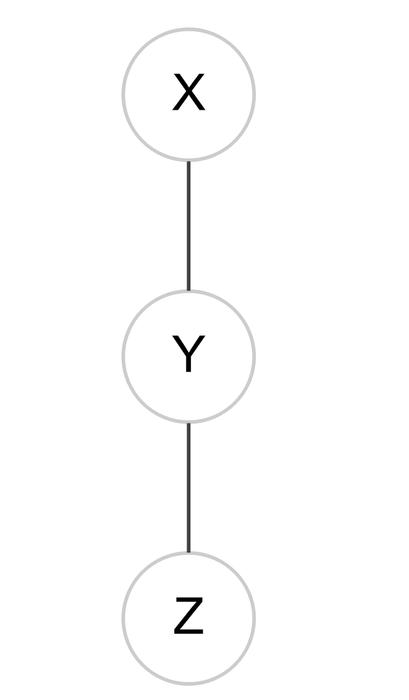
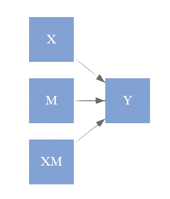
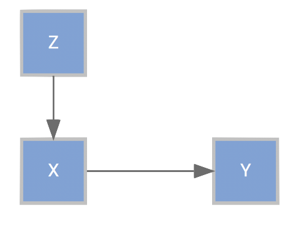

# (PART\*) Part I: Core SEM {-}

# Graphical Models

```{r setupGM, include=FALSE, cache=FALSE}
knitr::clean_cache(clean=T)
knitr::opts_chunk$set(cache.rebuild=F, cache=F)
library(lavaan); library(DiagrammeR); library(bnlearn); library(visNetwork); library(igraph) # only load mediation as needed
```

A graphical model can be seen as a mathematical or statistical construct connecting *nodes* (or vertices) via *edges* (or links).  When pertaining to statistical models, the nodes might represent variables of interest in our data set, and edges specify the relationships among them.  Visually they are depicted in the style of the following examples.


```{r graphVizExample, echo=FALSE, eval=FALSE}
# encoding issue with icons means just creating the png instead
tags$div(style="width:50%; margin-left:auto;  margin-right:auto; background:transparent; background-color:'#fffff8'",
DiagrammeR("
digraph DAG {
  # Intialization of graph attributes
  graph [overlap = false  fill='#fffff8']

  # Initialization of node attributes
  node [shape = circle,
        fontname = Helvetica,
        color = gray80,
        type = box,
        fixedsize = true]

  # Initialization of edge attributes
  edge [color = gray25, rel = yields]

  # Node statements
  X; Y; Z; ☺;  1; 2; 3;

  node [fontcolor = 'darkred']
  ♥; ☻;                         # Diagrammer/graphviz doesn't recognize this

  # Edge statements
  X -> Y; Z -> Y;
  ☺ -> ♥; ♥ -> ☻; ☺->☻;

  # Initialization of edge attributes
  edge [color = gray25, rel = yields, arrowhead=none]
  1 -> 2; 2 -> 3; 1 -> 3;
}
", type='grViz')
)

```


Any statistical model you've conducted can be expressed as a graphical model.  As an example, the first graph with nodes X, Y, and Z might represent a regression model in which X and Z predict Y.  The emoticon graph shows an indirect effect, and the 123 graph might represent a correlation matrix.

A key idea of a graphical model is that of <span class="emph">conditional independence</span>, something one should keep in mind when constructing their models.  The concept can be demonstrated with the following graph.

```{r conditionalIndependence, echo=FALSE, eval=F}
tags$div(style="width:500px; margin:0 auto; font-family:Roboto; font-size:50%;", 
DiagrammeR::DiagrammeR("scripts/condindie.gv", type='grViz', width=500, height=250))
# export_graph() # won't work except on dgr objects of course
# 
```
<br>
In this graph, X is *conditionally independent* of Z given Y- there is no correlation between X and Z once Y is accounted for[^condind].  We will revisit this concept when discussing path analysis and latent variable models.  Graphs can be *directed*, *undirected*, or *mixed*. Directed graphs have arrows, sometimes implying a causal flow (a difficult endeavor to demonstrate explicitly) or noting a time component. Undirected graphs merely denote relations among the nodes, while mixed graphs might contain both directional and symmetric relationships.  Most of the models discussed in this document will be directed or mixed.


## Directed Graphs

As noted previously, we can represent standard models as graphical models.  In most of these cases we'd be dealing with directed or mixed graphs.  Almost always we are specifically dealing with directed *acyclic* graphs, where there are no feedback loops.


### Standard linear model

Let's start with the standard linear model (SLiM), i.e. a basic regression we might estimate via ordinary least squares (but not necessarily). In this setting, we want to examine the effect of each potential predictor (x* in the graph) on the target variable (y).  The following shows what the graphical model might look like.


```{r SLiMasGraph, echo=FALSE, eval=TRUE}
# library(lavaan)
# X = cbind(1, matrix(rnorm(150), 50))
# y = X %*% c(2,.2,-.2,0) + rnorm(50)
# d = data.frame(X1 = X[,2], X2=X[,3], X3=X[,4], y)
# model = "
# y ~ X1 + X2 + X3
# "
# out = sem(model, data=d)
# psych::lavaan.diagram(out, regression=TRUE)
# 
# # X7 <- matrix(c("a","b","c","d","e","f"),nrow=6)
# # structure.diagram(X7,regression=TRUE)
# 
# 
# d = matrix(c('', '',''), nrow=3)
# psych::structure.diagram(d,regression=TRUE, labels=c('X1', 'X2', 'X3','Y'))
# 
# 
# library(DiagrammeR)

tags$div(style="width:500px; margin:0 auto; font-family:Roboto; font-size:50%;",
DiagrammeR::DiagrammeR("scripts/SLiM.gv", type='grViz', width=500, height=250))
```

<br>

<!--  -->

While we start simpler, we can use much of the same sort of thinking with more complex models later.  In what follows, we'll show that whether we use a standard R modeling approach (via the <span class="func">lm</span> function), or an SEM approach (via the <span class="func">sem</span> function in <span class="pack">lavaan</span>), the results are identical aside from the fact that sem is using maximum likelihood (so the variances will be slightly different).  First, we'll with the standard <span class="func">lm</span> approach.

```{r lmvslavaan1, cache=TRUE}
mcclelland = haven::read_dta('data/path_analysis_data.dta')
lmModel = lm(math21 ~ male + math7 + read7 + momed, data=mcclelland)
```

Now we can do the same model using the lavaan package, and while the input form will change a bit, and the output will be presented in a manner consistent with SEM, the estimated parameters are identical. Note that the square of the residual standard error in the <span class="func">lm</span> output is compared to the variance estimate in the lavaan output.

```{r lmvslavaan2, cache=TRUE}
library(lavaan)
model = "
  math21 ~ male + math7 + read7 + momed 
"
semModel = sem(model, data=mcclelland, meanstructure = TRUE)

summary(lmModel)
summary(semModel, rsq=T)
```

As we will see in more detail later, SEM incorporates more complicated regression models, but at this point the parameters have the exact same understanding as our standard regression, because there is no difference between the two models except conceptually, in that SEM explicitly brings a causal aspect to bear on the interpretation. As we go along, we can see the structural equation models statistically as generalizations of those we are already well acquainted with, and so one can use that prior knowledge as a basis for understanding the newer ones.

### Path Analysis

<span class='emph'>Path Analysis</span>, and thus SEM, while new to some, is in fact a very, very old technique, statistically speaking[^pathOld].  It can be seen as a generalization of the SLiM approach that can allow for indirect effects and multiple target variables.  Path analysis also has a long history in the econometrics literature though under different names (e.g. instrumental variable regression, 2-stage least squares etc.), and through the computer science realm through the use of graphical models more generally.  As such, there are many tools at your disposal for examining such models, and I'll iterate that much of the SEM perspective on modeling comes largely from specific disciplines (especially psychology and education), while other approaches that are very common in other disciplines may be better for your situation.


#### Types of relationships

The types of potential relationships examined by path analysis can be seen below.


Most models deal only with <span class="emph">direct effects</span>.  In this case there are no intervening variables we wish to consider.  If such variables do exist, we are then dealing with what is often called a mediation model, and must interpret both <span class="emph">indirect</span> and (potentially) direct effects.  When dealing with multiple outcomes, some may have predictors in common, such that the outcomes' correlation can be explained by those <span class="emph">common causes</span> (this will come up in factor analysis later).  Often there are <span class="emph">unanalyzed correlations</span>. As an example, every time you run a regression, the correlations among predictor variables are left 'unanalyzed'. 


#### Multiple Targets

While relatively seldom used, multivariate linear regression[^mvreg] is actually very straightforward in some programming environments such as R, and conducting models with multivariate outcomes does not require anything specific to SEM, but that is the realm we'll stick with.  Using the [McClelland data][McClelland], let's try it for ourselves. First, let's look at the data to get a sense of things.

```{r mcclellanddat, echo=F, cache=T}
# note something has seriously borked with htmlwidgets and bookdown as of May 2018
describe_all_num(mcclelland) %>% 
  kable(format = 'html') %>%
  kable_styling(full_width = F)

numericdat = select(mcclelland, -college, -college_missing, -male, -adopted)
```

<br>

```{r mcclellandCors, echo=F, cache=FALSE}
# this is the only thing working right now
# tags$div(style="width:250px; margin:0 auto;",
#          corr_heat(cor(numericdat, use='pair')))

corr_heat(cor(numericdat, use='pair'))
```

<br>

While these are only weakly correlated variables to begin with, one plausible model might try to predict math and reading at age 21 with measures taken at prior years. 

```{r paMultipleTargets}
model = "
  read21 ~ attention4 + vocab4 + read7
  math21 ~ attention4 + math7
  read21 ~~ 0*math21
"
mvregModel  = sem(model, data=mcclelland, missing='listwise', meanstructure = T)
coef(mvregModel)
```

The last line of the model code clarifies that we are treating **math21** and **read21** as independent, and as such we are simply running two separate regressions simultaneously.  Note also that the coefficients in the output with `~1` are the intercepts.  We can compare this to standard R regression.  A first step is taken to make the data equal to what was used in <span class="pack">lavaan</span>. For that we can use the <span class="pack">dplyr</span> package to select the necessary variables for the model, and then omit rows that have any missing.

```{r regvspath1, cache=TRUE}
mcclellandComplete = select(mcclelland, read21, math21, attention4, vocab4, read7, math7) %>% 
  na.omit
lm(read21 ~ attention4 + vocab4 + read7, data=mcclellandComplete)
lm(math21 ~ attention4 + math7, data=mcclellandComplete)
```

Note that had the models for both outcomes been identical, we could have run both outcomes simultaneously using <span class="func">cbind</span> on the dependent variables[^notmvreg]. However, we can and probably should estimate the covariance of math and reading skill at age 21.  Let's rerun the path analysis removing that <span class="emph">constraint</span>.

```{r paMultipleTargets2, cache=TRUE}
model = "
  read21 ~ attention4 + vocab4 + read7
  math21 ~ attention4 + math7
"
mvregModel  = sem(model, data=mcclelland, missing='listwise', meanstructure = T)
coef(mvregModel)
```

We can see that the coefficients are now slightly different from the SLiM approach. The `read21~~math21` value represents the residual covariance between math and reading at age 21, i.e. after accounting for the other covariate relationships modeled, it tells us how correlated those skills are. Using <span class='func'>summary</span> will show it to be statistically significant.  I additionally ask for standardized output to see the correlation along with the covariance.  It actually is not very strong even if it is statistically significant.

```{r summaryPaMultipleTargets2, eval=T, cache=TRUE}
summary(mvregModel, standardized=T)
```

Whether or not to take a multivariate/path-analytic approach vs. separate regressions is left to the researcher. It's perhaps easier to explain univariate models in some circumstances.  But as the above shows, it doesn't take much to take into account correlated target variables.


#### Indirect Effects

So path analysis allows for multiple target variables, with the same or a mix of covariates for each target.  What about <span class='emph'>indirect effects</span>? Standard regression models examine direct effects only, and the regression coefficients reflect that direct effect.  However, perhaps we think a particular covariate causes some change in another, which then causes some change in the target variable.  This is especially true when some measures are collected at different time points.  Note that in SEM, any variable in which an arrow is pointing to it in the graphical depiction is often called an <span class="emph">endogenous</span> variable, while those that only have arrows going out from them are <span class="emph">exogenous</span>.  Exogenous variables may still have (unanalyzed) correlations among them.  As we will see later, both observed and latent variables may be endogenous or exogenous.

Consider the following model.


```{r mediationDiag, echo=FALSE, eval=TRUE, cache=FALSE, fig.align='center'}
# tags$div(style="width:500px; margin:0 auto; font-family:Roboto; font-size:50%",
#          DiagrammeR::grViz('scripts/mediation.gv', width=500, height=250))

# DiagrammeR::grViz('scripts/mediation.gv')

```


Here we posit attention span and vocabulary at age 4 as indicative of what to expect for reading skill at age 7, and that is ultimately seen as a precursor to adult reading ability. In this model, attention span and vocabulary at 4 only have an indirect effect on adult reading ability through earlier reading skill.  At least temporally it makes sense, so let's code this up.

```{r mediationModel, cache=TRUE}
model = "
  read21 ~ read7
  read7 ~ attention4 + vocab4
"

mediationModel  = sem(model, data=mcclelland)
summary(mediationModel, rsquare=TRUE)
```

What does this tell us? As before, we interpret the results as we would any other regression model, though conceptually there are two sets of models to consider (though they are estimated simultaneously[^oldMediation]), one for reading at age 7 and one for reading at age 21. And indeed, one can think of path analysis as a series of linked regression models[^linkedreg]. Here we have positive relationships between both attention and vocabulary at age 4 and reading at age 7, and a positive effect of reading at age 7 on reading at age 21.  Statistically speaking, our model appears to be viable, as there appear to be statistically significant estimates for each path. 

However, look at the R^2^ value for reading at age 7.  We now see that there is little to no *practical* effect of the age 4 variables at all, as all we are accounting for is < 4% of the variance, and all that we have really discovered is that prior reading ability affects later reading ability.  

We can test the indirect effect itself by labeling the paths in the model code.  In the following code, I label them based on the first letter of the variables involved (e.g. `vr` refers to the vocab to reading path), but note that these are arbitrary names.  I also add the direct effects of the early age variable. While the indirect effect for vocab is statistically significant, as we already know there is not a strong correlation between these two variables, it's is largely driven by the strong relationship between reading at age 7 and reading at age 21, which is probably not all that interesting.  A comparison of AIC values, something we'll talk more about later, would favor a model with only direct effects[^medvsdirectModcomp].

```{r mediationModelTestIndir, cache=TRUE}
model = "
  read21 ~ rr*read7 + attention4 + vocab4
  read7 ~ ar*attention4 + vr*vocab4
  
  # Indirect effects
  att4_read21 := ar*rr
  vocab4_read21 := vr*rr
"

mediationModel  = sem(model, data=mcclelland)
summary(mediationModel, rsquare=TRUE, fit=T, std=T)
```


In the original article, I did not find their description or diagrams of the models detailed enough to know precisely what the model was in the actual study[^mccnodescript], but here is at least one interpretation if you'd like to examine it further.

```{r mcclellandStudy, eval=FALSE, cache=TRUE}
modReading = "
  read21 ~ read7 + attention4 + vocab4 + male + adopted + momed
  read7 ~ attention4 + vocab4
"
reading  = sem(modReading, data=mcclelland, missing='fiml', mimic = 'Mplus', std.ov=TRUE)
summary(reading, rsquare=TRUE)
```


#### More mediation

Here I would like to demonstrate a powerful approach to mediation models using Imai's <span class="pack">mediation</span> package. It is based on a theoretical framework that allows for notably complex models for mediator, outcome or both, including different types of variables for the mediator and outcome.  While it is simple to conduct, the results suggest there are more things to think about when it comes to mediation.  

To begin, we will run two separate models, one for the mediator and one for the outcome, using the mediate function to use them to estimate the mediation effect. In this case we'll focus on the indirect effect of attention.


```{r imai0, cache=F, echo=F, eval=FALSE}
# due to time and mediation loading everything under the sun, just run this and
# save out as RData; show the next one so you don't have comment signs
library(mediation)
mediator_model = lm(read7 ~ attention4 + vocab4, data=mcclellandComplete)
outcome_model = lm(read21 ~ read7 + attention4 + vocab4, data=mcclellandComplete)
results = mediate(mediator_model, outcome_model, treat="attention4", mediator = 'read7')
save(results, file='data/imai_results.RData')
```


```{r imai, cache=F, eval=FALSE}
library(mediation)
mediator_model = lm(read7 ~ attention4 + vocab4, data=mcclellandComplete)
outcome_model = lm(read21 ~ read7 + attention4 + vocab4, data=mcclellandComplete)
results = mediate(mediator_model, outcome_model, treat="attention4", mediator = 'read7')
summary(results)
```
```{r printImai, echo=FALSE}
load('data/imai_results.RData')
mediation::summary.mediate(results)
```


```{r removeMASS, include=FALSE, eval=F}
# sigh; if you do run the previous chunk
detach(package:mediation); detach(package:MASS)
```


The first thing to note is that there are multiple results to consider, we have the average causal mediated effect, the average direct effect, the total effect and the proportion mediated. What is an <span class="emph">average causal mediated effect</span>?  First, think about a standard experimental design in which participants are assigned to control and treatment groups.  Ideally, if we really wanted to know about true effects, we'd see the outcome when an individual was a control and when they were were in the treatment. The true *causal* effect for an individual would be the difference between their scores when in the control and when in the treatment. Thus there are two hypothetical situations of different conditions, or <span class="emph">counterfactuals</span>, of interest- what would be the *potential* outcome of a control case if they treated, and vice versa for those in the treated group[^potout_vs_counterfact].

This <span class="emph">potential outcomes framework</span> is the essence of the <span class="func">mediate</span> function. In the presence of a mediator variable, we can start by defining the <span class="emph">average direct effect</span> (ζ) as follows, where $Y_i$ is the potential outcome for unit $i$ (e.g. a person), $M_i$ the potential outcome of the mediator, and $T_i$ the treatment status. From the mediate function help file[^imai_links]:

> The expected difference in the potential outcome when the treatment is changed but the mediator is held constant at the value that would realize if the treatment equals $t$

$$ζ(t) = E[Y(t_1, M(t)) - Y(t_0, M(t))]$$

The **ACME** meanwhile is:

> The expected difference (δ) in the *potential outcome* when the mediator took the value that would realize under the treatment condition as opposed to the control condition, while the treatment status itself is held constant.

$$δ(t) = E[Y(t, M(t_1)) - Y(t, M(t_0))]$$


> where $t$, $t_1$, $t_0$ are particular values of the treatment T such that $t_1 \neq t_0$, M(t) is the potential mediator, and Y(t,m) is the potential outcome variable.

Adding these two gives us the <span class="emph">total effect</span>.  In the case of continuous variables, the values for 'control' and 'treatment' are fixed to specific values of interest, but by default represent a unit difference in the values of the variable. The results of the <span class="func">mediate</span> function are based on a simulation approach, and averaged over those simulations.  You'll note there is also a 'proportion of effect mediated'. This is the size of the ACME to the the total effect.  It too is averaged over the simulations (and thus is not simply the ACME/Total Effect reported values).  It's not clear to me how useful of a notion this is, and as noted by the boundaries, it's actually a ratio as opposed to a true proportion (as calculated), such that under some simulations the value can be negative or greater than 1.


You may compare the result with the previous <span class="pack">lavaan</span> results.  I've rerun it with bootstrap estimates (set `se='boot'`) to be more in keeping with the simulation approach of Imai[^bootmed].   You could also use the <span class="pack">blavaan</span> package to get true Bayesian estimates.

```{r imai_vs_lavaan, echo=F, cache=T}
mediationModel  = sem(model, data=mcclelland, se='boot')
# lavaan estimate
parameterestimates(mediationModel) %>% 
  filter(label=='att4_read21' | (lhs =='read21' & rhs=='attention4')) %>% 
  mutate_if(is.numeric, round, digits=3) %>% 
  arrange(lhs)

# comparison sims
# coefs = mvrnorm(1000, mu=coef(outcome_model), Sigma=vcov(outcome_model))
# de = matrix(c(1,0,0,0,1,0,1,0), ncol=4, byrow=T) %*% t(coefs)
# mean(apply(de, 2, diff))
```

As expected, the results of <span class="pack">lavaan</span> and <span class="pack">mediation</span> packages largely agree with one another.  However, the potential outcomes framework has the *product-of-paths* approach as a special case, and thus generalizes to different models and types of variables for the mediator and outcome.


##### Explicit Example

While we have shown how to use the tool and compared the outputs, let's make things more simple and explicit to be sure that we understand what's going on. The following closely follows [Pearl](http://ftp.cs.ucla.edu/pub/stat_ser/r370.pdf) (section 4.4)[^docalculus].  Consider the following three variable setup with estimated parameters.  We have a treatment variable that is dummy coded with 0 = 'Control group' and 1 = 'Treatment group', a continuous Mediator and Target variable.

```{r cfgraph, echo=FALSE}
tags$div(style="width:500px; margin:0 auto; font-family:Roboto; font-size:50%", 
DiagrammeR::DiagrammeR("scripts/counterfact.gv", type='grViz', width=500, height=250))
```

<br>

In addition, we'll consider just a single individual, whose observed values are 'control', i.e. 0, 3 for the mediator, and 2 for the target.  We define the unique values $\epsilon_*$ that represent invariant characteristics that exist regardless of changes to interventions or counterfactual hypotheses and set them to the following:

$\epsilon_1 = 0$

$\epsilon_2 = 3 - 0*.3 = 3$

$\epsilon_3 = 2 - 0*.5 - 3*.2 = 1.4$


If a person is in the control group, this setup suggests the predicted value for the Target would be 3\*.2 + 1.4 = 2.  Let's now figure out what the value would be if this person was in the treatment.  The Mediator value would  now be 3 + 1\*.3 = 3.3.  This would in turn result in a predicted Target value as follows: 1.4 + 3.3\*.2 + 1\*.5 = 2.56. And we could take this approach for other situations.  We could, for example, ask what the expected value be if the Treatment level is 0, but the Mediator was at whatever value it would have been, had the person received the treatment?  The value is 3.3\*.2 + 1.4 = 2.06, which if we subtract from when they are are fully in the control group gives us the mediated effect 2.06 - 2 = .06.  In this linear model it is equivalent to indirect effect via the product-of-paths approach, .3\*.2 = .06.  But now with the estimate based on the target variable rather than coefficients, we don't have to be restricted to linear models.

```{r simmed, echo=F, eval=F}
set.seed(123)
N = 10000
Treatment = rep(0:1, length.out = N)
Mediator = 3 + .3*Treatment + rnorm(N, sd=.1)
Target = 0 + .5*Treatment + .2*Mediator + rnorm(N, sd=.1)
d = data_frame(Treatment, Mediator, Target)

cf = '
Mediator ~ Treatment
Target ~ Mediator + Treatment
'


cfmod = sem(cf, data=d)
# summary(cfmod)
# semPlot::semPaths(cfmod, what = 'est', style = 'lisrel', nDigits = 1, layout = 'tree2', rotation = 2)

library(mediation)
mediator_model = lm(Mediator ~ Treatment, data=d)
outcome_model = lm(Target ~ Treatment  + Mediator, data=d)
med_result = mediate(model.m = mediator_model, model.y = outcome_model, treat = 'Treatment', mediator = 'Mediator')
summary(med_result)
dmed = data_frame(d0_sim=c(med_result$d0.sims), d1_sim=c(med_result$d0.sims))
dmed %>% 
  gather(key=situation, value=effect) %>% 
  ggplot(aes(x=effect, group=situation)) +
  geom_density(aes(fill=situation))
```

One thing to note about the above, despite not having a data set or statistical result, we engaged in attempting to understand causal relations among the variables under theoretical consideration.  Even though we may use the tools of statistical analysis, the key things that separates SEM and common regression approaches is the *explicit* assumption of causal relations and the ability to test some causal claims[^bollenpearl].


#### Cavets about indirect effects

One should think very hard about positing an indirect effect, especially if there is no time component or obvious pseudo-causal path.  If the effect isn't immediately obvious, or you are dealing with cross-sectional data, then you should probably just examine the direct effects.  Unlike other standard explorations one might do with models (e.g. look for nonlinear relationships), the underlying causal connection and associated assumptions are more explicit in this context.  Many models I've seen in consulting struck me as arbitrary as far as which covariate served as the mediator, required a fairly convoluted explanation for its justification, or ignored other relevant variables because the reasoning would have to include a plethora of indirect effects if it were to be logically consistent.  Furthermore, I can often ask one or two questions and will discover that researchers are actually interested in interactions (i.e. moderation), rather than indirect effects.

This document will not get into models that have *moderated mediation* and *mediated moderation*. In my experience these are often  associated with models that are difficult to interpret at best, or are otherwise not grounded very strongly in substantive concerns[^modmed].  However, there are times, e.g. in experimental settings, which surprisingly few SEM are applied to for reasons unknown, where perhaps it would be very much appropriate. It is left to the reader to investigate those particular complexities when the time comes.

Too often investigators will merely throw in these indirect effects and simply report whether the effect is significant or not. If you hide their results and ask if the indirect effect is positive or negative, I suspect they might not even know.  Even if not used, I think the perspective of the potential outcomes framework can help one think appropriately about the situation, and avoid unnecessary complications. If one wants to *explore* possible indirect paths, there are better [approaches][Bayesian Networks] which are still rooted within the structural causal model framework, which we'll see shortly.  In addition, a mediation model should always be compared to a simpler model with no mediation (e.g. via AIC).


#### Terminology issues

Some refer to models with indirect effects as <span class="emph">mediation</span> models[^kline_indvmed], and that terminology appears commonly in the SEM (and esp. psychology) literature[^buffer].  Many applied researchers just starting out with SEM often confuse the term with <span class="emph">moderation</span>, which is called an <span class="emph">interaction</span> in every other statistical modeling context. As you begin your SEM journey, referring to <span class="emph">indirect effects</span> and <span class="emph">interactions</span> will likely keep you clear on what you're modeling, and perhaps be clearer to those who may not be as familiar with SEM when you present your work.

In models with moderation, one will often see a specific variable denoted as the *moderator*. However, this is completely arbitrary in the vast majority of situations in which it is used. In a typical model that includes an interaction, it makes just as much sense to say that the $\mathcal{A} \rightarrow \mathcal{Y}$ relationship varies as a function of $\mathcal{B}$ as it does the $\mathcal{B} \rightarrow \mathcal{Y}$ relationship varies as a function of $\mathcal{A}$.  Some suggest using the term *moderation* when only when there is a potential causal relation, almost always temporal in nature, such that the moderator variable precedes the variable in question. In addition, the moderator and the variable moderated must be *uncorrelated*[^wuzumbo].  While such restrictions would render almost every model I've ever seen that uses the term moderation as an ordinary interaction instead, the idea is that the moderator has a causal effect on the path between the variable in question and its target.  This is why you see graphs like the one to the left below, which has no tie to any statistical model and generally confuses people more often than it illuminates (the *correct* graph is to the right).  Again though, the actual model is statistically indistinguishable from a standard model including an interaction, so if you want to understand moderation, you simply need to understand what an interaction is. 

<!--  -->

```{r modpic, echo=FALSE, eval=F, cache=F, fig.align='right', out.width='50%'}
# whatever code diagrammer is producing for this will just screw any number of things up, including subsequent graphs; even running just one of them separately it will display a previous graph instead of the correct one.  Have given up 
# tags$div(style="width:500px; margin:0 auto; font-family:Roboto; font-size:50%",
# DiagrammeR::DiagrammeR("scripts/moderation0.gv", type='grViz', width=400, height=200)
# )
# 
# tags$div(style="width:500px; margin:0 auto; font-family:Roboto; font-size:50%",
# DiagrammeR::DiagrammeR("scripts/moderation.gv", type='grViz', width=400, height=200)
# )
```

<div class='col2' text-align='center'>


</div>

<br>
Like SEM relative to standard modeling techniques, so too is mediation and moderation to indirect effects and interactions. Statistically they are indistinguishable models. Theoretically however, there is an underlying causal framework, and in some cases specific causal claims can be tested (e.g. via simulation).

Recently I have also heard the phrase 'spotlight analysis' to refer to a categorical by continuous variable interaction. Please don't apply new terms to very old techniques in an attempt to make a model sound more interesting[^psychlit]. The work should speak for itself and be as clearly expressed as possible.

The gist is that if you want to talk about your relations using the terms 'mediation' and 'moderation' you'll want to have specific and explicit causal relations among the variables.  If you are unsure, then the answer is clearly that you don't have that situation.  However, you can still incorporate interactions as usual, and explore potential indirect effects by modeling the correlations, e.g. leaving the indirect path undirected.


#### Aside: Instrumental variables

Path analysis of a different sort has a long history in econometrics.  A very common approach one may see utilized is <span class="emph">instrumental variable</span> analysis. The model can be depicted graphically as follows:

```{r ivmodel, echo=FALSE, eval=F, cache=FALSE, fig.align='center'}
tags$div(style="width:500px; margin:0 auto; font-family:Roboto; font-size:50%",
         DiagrammeR::grViz('scripts/iv.gv', width=500, height=250))
```



In the graph, $\mathcal{Y}$ is our target variable, $\mathcal{X}$ is the causal variable of interest, and $\mathcal{Z}$ the instrument. The instrumental variable must not be correlated with disturbance of the target variable (later depicted as $\mathcal{U}$), and only has an indirect relation to $\mathcal{Y}$ through $\mathcal{X}$.  Neither target nor causal variable are allowed to effect the instrument directly or indirectly.  In graph theory, this involves the notion of conditional independence we've mentioned before, where $\mathcal{Z}$ is conditionally independent of Y given X, or in other words, if we remove the $\mathcal{X} \rightarrow \mathcal{Y}$ path, $\mathcal{Z}$ and $\mathcal{Y}$ are independent.  Furthermore, $\mathcal{Z}$ is *not* conditionally independent of $\mathcal{X}$ with the removal of that path[^direct].

The motivating factor for such a model is that the simple $\mathcal{X} \rightarrow \mathcal{Y}$ path may not provide a means for determining a causal relationship, particularly if $\mathcal{X}$ is correlated with the error. As an example[^CamTriv], if we look at the relationship of earnings with education, the unspecified causes of earnings might include things, e.g. some general 'ability', that would be correlated with the potential causal variable of education attained. With error $\mathcal{U}$ we can show the following diagram that depicts the problem.

```{r ivxyu, echo=FALSE, eval=TRUE, cache=FALSE, fig.align='center'}
tags$div(style="width:500px; margin:0 auto; font-family:Roboto; font-size:50%",
         DiagrammeR::grViz('scripts/ivxyu.gv', width=500, height=250))
```

<br>

When $\mathcal{X}$ is endogenous, that is not the case. Changes in $\mathcal{X}$ are associated with $\mathcal{Y}$, but also $\mathcal{U}$.

<br>

```{r ivxyu2, echo=FALSE, eval=TRUE, cache=FALSE, fig.align='center'}
tags$div(style="width:500px; margin:0 auto; font-family:Roboto; font-size:50%",
         DiagrammeR::grViz('scripts/ivxyu2.gv', width=500, height=250))
```

<br>

There are now multiple effects of $\mathcal{X}$ on $\mathcal{Y}$, both directly from $\mathcal{X}$ and indirectly from $\mathcal{U}$.  We can measure the association between $\mathcal{X}$ and $\mathcal{Y}$, but not the causal relationship.

An attempt can be made to remedy the problem by using an instrument, leading the following graph.
<br>

```{r ivxyzu, echo=FALSE, eval=TRUE, cache=FALSE, fig.align='center'}
tags$div(style="width:500px; margin:0 auto; font-family:Roboto; font-size:50%",
         DiagrammeR::grViz('scripts/ivxyzu.gv', width=500, height=250))
```

<br>

The instrument $\mathcal{Z}$ affects $\mathcal{X}$ and thus is correlated with $\mathcal{Y}$ indirectly.  However, unlike $\mathcal{X}$, it is uncorrelated with $\mathcal{U}$.  This assumption excludes $\mathcal{Z}$ from having a direct effect in the
model for $\mathcal{Y}$. If instead $\mathcal{Y}$ depended on both $\mathcal{X}$ and $\mathcal{Z}$ but only $\mathcal{X}$ has a direct path to $\mathcal{Y}$, then $\mathcal{Z}$ is basically absorbed into the error so would be correlated with it. With the direct path from $\mathcal{Z}$ to $\mathcal{Y}$ not allowed, we are left with only its influence on $\mathcal{X}$ .


Such models were commonly fit with a technique known two-stage least squares, which is demonstrated here.  I use a subset of the <span class="objclass">CigarettesSW</span> data set and <span class="func">ivreg</span> function from the <span class="pack">AER</span> package for comparison.  The data concerns cigarette consumption for the 48 continental US States from 1985–1995, though only the last year is used for our purposes.  Here we examine the effect on packs per capita (packs) of price (`rprice`), using state level income (`rincome`) as the instrumental variable. See the help file for the <span class="objclass">CigarettesSW</span> for more on this data.

```{r ivreg, echo=-c(1:7, 10:11, 22), cache=TRUE}
# library(AER) # don't use AER directly since AER loads several plus their deps including MASS
data("CigarettesSW", package = "AER")
CigarettesSW$rprice = with(CigarettesSW, price/cpi)
CigarettesSW$rincome = with(CigarettesSW, income/population/cpi)
CigarettesSW$tdiff = with(CigarettesSW, (taxs - tax)/cpi)
Cigarettes = select(CigarettesSW, state, rprice, rincome, tdiff, tax, cpi, packs, year) %>% 
  filter(year=='1995')

head(Cigarettes)     # raw, logged values actually used in models

Ciglog  = select(Cigarettes, packs, rprice, rincome) %>% 
  mutate_all(log)
Cigarettes = Ciglog

# explicit 2sls
mod0 = lm(rprice ~  rincome , data = Cigarettes)
lm(packs ~ fitted(mod0), data = Cigarettes) 

## using AER package
ivmod = AER::ivreg(packs ~ rprice | rincome,  data = Cigarettes)
summary(ivmod)

ymod = lm(packs ~ rincome, data = Cigarettes)
```

We can see that these both produce the same results, though actually doing the piecemeal regression would lead to problematic standard errors.  However, by using the fitted values from the regression of $\mathcal{X}$ on $\mathcal{Z}$, we are now able to essentially get the effect of $\mathcal{X}$ untainted by $\mathcal{U}$.  To see more clearly where the effect comes from, the coefficient of regressing `packs` on `income` is `r  round(coef(ymod)[2], 3)`, and dividing that by the coefficient of `price` on `income`, `r round(coef(mod0)[2], 3)`, will provide the ultimate effect of price on the pack of cigarettes that we see above.

We can run the path model in <span class="pack">lavaan</span> as well. Note the slight difference between what we'd normally code up for a path model. In order to get the same results as instrumental variable regression, we have to explicitly add an estimate of the packs disturbance with price.

```{r lavaan_ivreg, cache=TRUE}
mod = '
  packs ~ rprice
  rprice ~ rincome
  packs ~~ rprice
'

modiv = sem(mod, data=Ciglog, meanstructure = T, se = 'robust')
summary(modiv)
```

While instrumental variable regression is common, this is perhaps not a typical path model seen in SEM. With SEM, a model comparison approach might be taken to compare models of competing complexity.  One issue not discussed is where instruments come from.  Generally data is not collected with acquiring them in mind, so it might be very difficult to use such an analysis.  Furthermore, the structured causal framework that includes SEM would generally be a more flexible approach.

##### Heckman Selection Model

A different kind of instrumental variable model comes into play with sample selection models.  Very common in econometrics or those exposed to it, and practically nowhere else, in this situation, our dependent variable is censored in some fashion, such that we only observe some the population.  The classic, and evidently only, textbook example you'll find on this regards the wages of working women.  Here is the description from the Stata manual.

> In one classic example, the first equation describes the wages of women. Women choose whether to work, and thus, from our point of view as researchers, whether we observe their wages in our data. If women made this decision randomly, we could ignore that not all wages are observed and use ordinary regression to fit a wage model. Such an assumption of random participation, however, is unlikely to be true; women who would have low wages may be unlikely to choose to work, and thus the sample of observed wages is biased upward. In the jargon of economics, women choose not to work when their personal reservation wage is greater than the wage offered by employers. Thus women who choose not to work might have even higher offer wages than those who do work—they may have high offer wages, but they have even higher reservation wages. We could tell a story that competency is related to wages, but competency is rewarded more at home than in the labor force.

So the primary problem here again is bias. Now you may say- but I'm not interested in the generalizing to all women[^modelmissing], or, if I were really worried about exact inference there are a whole host of other things being ignored, but the economists will have none of it[^vogons].  Conceptually, the model is as follows:

$$ y = X\beta + \epsilon$$
$$\mathrm{observed} = Z\gamma + \nu$$
$$\begin{pmatrix}
\epsilon \\ \nu
\end{pmatrix}
\sim N\begin{bmatrix}
\begin{pmatrix}
0 \\ 0
\end{pmatrix},
\begin{pmatrix}
\sigma & \rho\\
\rho & 1
\end{pmatrix}\end{bmatrix}$$

There are actually two models to consider- one that we care about, and one regarding whether we observe the target variable $y$ or not. As before, we have the correlated errors issue, and, as with instrumental variable regression, we can take a two step approach here, albeit a bit differently. In the one model, we will predict whether the data is observed or not using a probit model. Then we'll use a variable based on the fits from that model in the next step. Note these are not the fitted values, but the <span class="emph">inverse Mills ratio</span>, or in survival model lingo, the nonselection hazard, based on them.   I show results using the <span class="pack">sampleSelection</span> package, and how to duplicate the process with standard R model functions.

```{r heckman}
wages = haven::read_dta('data/heckman_women.dta') 
library(sampleSelection)
wages$select_outcome = factor(!is.na(wages$wage), labels=c('not', 'observed'))

selection_model = selection(select_outcome ~ married + children + education + age, 
                            wage ~ education + age,
                            data=wages, method='2step')
summary(selection_model)


# probit model
probit = glm(select_outcome ~ married + children + education + age, 
             data=wages, 
             family=binomial(link = 'probit'))

# setup for wage model
probit_lp = predict(probit)
mills0 = dnorm(probit_lp)/pnorm(probit_lp)
imr = mills0[wages$select_outcome=='observed']

lm_select = lm(wage ~ education + age + imr, data=filter(wages, select_outcome=='observed'))
summary(probit)
summary(lm_select)
```

Dividing the coefficient for `imr` by $\sigma$ will give you a rough estimate of $\rho$, but the $\sigma$ from the package results is the <span class="func">lm</span> <span class="objclass">sigma</span> plus an extra component, so the rough estimate of $\rho$ from just the <span class="func">lm</span> results will be a bit larger.

Unfortunately there isn't a real good way to formulate this in SEM.  Conceptually it's still an instrumental variable type of model, but the complete separation of the data, where part of the model only exists for one category means that standard approaches won't estimate it.  Probably a good thing in the end.  You could however estimate the IMR, and do the second step only using robust standard errors.  It still won't be exactly the same as the <span class="pack">sampleSelection</span> result, but close.  If you'd like to see more detail, check [this out](https://github.com/m-clark/Miscellaneous-R-Code/blob/master/ModelFitting/heckman_selection.R).

```{r heckman_misc, echo=FALSE, eval=FALSE}
heckmodel_sem = '
wage ~ education + age + select_outcome

select_outcome ~ married + children + education + age
wage ~~ select_outcome
select_outcome ~~ 1*select_outcome
'

```


#### Aside: Nonrecursive Models

Recursive models have all unidirectional causal effects and disturbances are not correlated. A model is considered nonrecursive if there is a reciprocal relationship, feedback loop, or correlated disturbance in the model[^nonrecursiveName]. Nonrecursive models are potentially problematic when there is not enough information to estimate the model (unidentified model), which is a common concern with them.

A classic example of a nonrecursive relationship is marital satisfaction: the more satisfied one partner is, the more satisfied the other, and vice versa (at least that's the theory). This can be represented by a simple model (below).


```{r nonRecursive_old, eval=FALSE, echo=F, fig.align='center', fig.height=2, dev='svg'}
WifeSatisfaction = rnorm(100)
HusbandSatisfaction = rnorm(100)
WifeEdu = rnorm(100)
HusbandEdu = rnorm(100)
FamIncome = rnorm(100)

model1 = '
WifeSatisfaction ~ .25*HusbandSatisfaction
HusbandSatisfaction ~ .5*WifeSatisfaction

WifeSatisfaction ~~ HusbandSatisfaction
HusbandSatisfaction ~~ 1*HusbandSatisfaction
WifeSatisfaction ~~ 1*WifeSatisfaction
'

m1 = sem(model1, data=data.frame(WifeSatisfaction, HusbandSatisfaction))
semPlot::semPaths(m1, layout='tree2', style='lisrel',rotation=2, covAtResiduals=F, 
                  # whatLabels = 'par', 
                  sizeMan=10, edge.label.cex=1.5, color='#ff5500', borders=F, 
                  label.color='#ffffff') # simply doesn't plot nonrecursive models correctly
```

```{r nonrecursive, echo=F, cache=FALSE}
tags$div(style="width:500px; margin:0 auto; font-family:Roboto; font-size:50%",
         DiagrammeR::grViz('scripts/nonrecursive.gv', width=500, height=250)
         )
```

<br>

Such models are notoriously difficult to specify in terms of *identification*, which we will talk more about later.  For now, we can simply say the above model would not even be estimated as there are more parameters to estimate (two paths, two variances) than there is information in the data (two variances and one covariance).

To make this model identified, we use <span class="emph">instrumental variables</span> as we did before. In this scenario, instrumental variables directly influence one of the variables in a recursive relationship, but not the other. For example, a wife’s education can influence her satisfaction directly and a husband’s education can influence his satisfaction directly, but a husband’s education cannot directly impact a wife’s satisfaction and vice versa (at least for this demonstration). These instrumental variables can indirectly impact a spouses’ satisfaction.  In the following model family income is also included.  The dashed line represents an unanalyzed correlation.

```{r nonRecursive2_old, eval=FALSE, echo=F, fig.align='center', dev='svg'}
model2 = '
WifeSatisfaction + HusbandSatisfaction ~ FamIncome
FamIncome ~ WifeEdu + HusbandEdu
WifeSatisfaction ~ HusbandSatisfaction + WifeEdu
HusbandSatisfaction ~ WifeSatisfaction + HusbandEdu
'

m2 = sem(model2, data=data.frame(WifeSatisfaction, HusbandSatisfaction, WifeEdu, HusbandEdu, FamIncome))
semPlot::semPaths(m2, layout='tree2', rotation=2, style='lisrel', curvePivot=T, nCharNodes=3,
                  sizeMan=10, edge.label.cex=1.5, color='#ff5500', borders=F, 
                  label.color='#ffffff') # simply doesn't plot res cov
```

```{r nonrecursive2, echo=FALSE, cache=FALSE}
tags$div(style="width:500px; margin:0 auto; font-family:Roboto; font-size:50%",
         DiagrammeR::grViz('scripts/nonrecursive2.gv', width=500, height=250)
         )
```

<br>

Many instances of nonrecursive models might better be represented by a correlation.  One must have a very strong theoretical motivation for such models, which is probably why they aren't seen as often in the SEM literature, though they are actually quite common in some areas such as economics, where theory is assumed to be stronger (by economists).


#### Aside: Tracing rule

In a recursive model, <span class="emph">implied correlations</span> between two variables, X1 and X2, can be found using <span class="emph">tracing rules</span>. Implied correlations between variables in a model are equal to the sum of the product of all standardized coefficients for the paths between them. Valid tracings are all routes between X1 and X2 that a) do not enter the same variable twice, and b) do not enter a variable through an arrowhead and leave through an arrowhead. The following examples assume the variables have been standardized (variance values equal to 1), if standardization has not occurred the variance of variables passed through should be included in the product of tracings.

Consider the following variables, A, B, and C (in a data frame called <span class="objclass">abc</span>) with a model seen in the below diagram. We are interested in identifying the implied correlation between x and z by decomposing the relationship into its different components and using tracing rules.

```{r traceCoefsInit, echo=F}
# because of MASS screwing up other packages; 
cormat = lazerhawk::create_corr(c(.2,.3,.7))
abc = MASS::mvrnorm(100, mu=rep(0,3), Sigma=cormat, empirical=TRUE)
colnames(abc) = LETTERS[1:3]
# psych::describe(abc)
```
<!-- something about semplot is screwy too, so don't cache it either -->

```{r traceCoefs, echo=1:6, cache=F, eval=T}
cor(abc)

model = "
  C ~ B + A
  B ~ A
"

pathMod = sem(model, data=abc)
coef(pathMod)
# semPlot::semPaths(pathMod, whatLabels = 'par', style = 'lisrel',  
#                   sizeMan=10, 
#                   edge.label.cex=1.25, edge.color='gray50',
#                   color='#1f65b780', 
#                   borders=T, border.color='gray80',  border.width=2,
#                   label.color='#ffffff', bg='transparent')

# starter code if you want to switch to Diagrammer
# lavaanPlot(model = pathMod,
#            node_options=list(fontsize=6, 
#                              color='gray80', 
#                              style='filled', 
#                              fontcolor='white', 
#                              fillcolor='"#1f65b780"', 
#                              fixedsize=2),
#            edge_options = list(color = "gray50"))
```


To reproduce the correlation between A and C (sometimes referred to as a 'total effect'):

- Corr = ac + ab * ac
- Corr = `r paste(round(coef(pathMod)[1],3), '+', round(prod(coef(pathMod)[2:3]),3))`
- Corr = `r coef(pathMod)[1] + prod(coef(pathMod)[2:3])`


In SEM models, it's important to consider how well our model-implied correlations correspond to the actual observed correlations. For *over-identified* models, the correlations will not be reproduced exactly, and thus can serve as a measure of how well our model fits the data. We'll discuss this more later.  In addition, the tracing of paths is important in understanding the <span class="emph">structural causal models</span> approach of Judea Pearl, of which SEM and the potential outcomes framework are part of.


## Bayesian Networks

In many cases of path analysis, the path model is not strongly supported by prior research or intuition, and in other cases, people are willing to use <span class='emph'>modification indices</span> after the fact to change the paths in their model. This is unfortunate, as their model is generally *overfit* to begin with, and more so if altered in such an ad hoc fashion.

A more exploratory approach to graphical models is available however.  <span class="emph">Bayesian Networks</span>, an approach within Pearl's structural causal model framework and which led to its development, are an alternative to graphical modeling of the sort we've been doing. Though they can be used to produce exactly the same results that we obtain with path analysis via maximum likelihood estimation, they can also be used for constrained or wholly exploratory endeavors as well, potentially with regularization in place to help reduce overfitting.

As an example, I use the McClelland data to explore potential paths via the <span class='pack'>bnlearn</span> package.  I make the constraints that variables later in time do not effect variables earlier in time[^time_cause], no variables are directed toward background characteristics like sex, and at least for these purposes I keep math and reading at a particular time from having paths to each other.  I show some of the so-called *blacklist* of constraints here.  Note that we can also require certain paths be in the model via a *whitelist*.

```{r blacklist, echo=F, eval=-c(3:10), cache=T}
mcclellandNoCollege = select(mcclelland, -college, -college_missing) %>% 
  na.omit %>% 
  sapply(as.numeric) %>% 
  data.frame
blacklist = data.frame(from = c(rep(c('read21', 'math21'), each=7), rep(c('read7','math7'), each=5),
                                rep(c('vocab4', 'attention4'), each=3),
                                rep(c('adopted',  'male', 'momed'), times=2),
                                'math21','read21', 'math7','read7'),
                       to = c(rep(c('read7', 'math7', 'attention4', 'vocab4', 'adopted',  'male', 'momed'), times=2),
                              rep(c('attention4', 'vocab4', 'adopted',  'male', 'momed'), times=2),
                              rep(c('adopted',  'male', 'momed'), times=2),
                              c('male',  'momed', 'adopted'), c('momed',  'adopted', 'male'),
                              'read21', 'math21','read7','math7'))
blacklist2 = data.frame(from = c(rep(c('read21', 'math21'), each=7), rep(c('read7','math7'), each=5),
                               rep(c('vocab4', 'attention4'), each=3),
                               rep(c('adopted',  'male', 'momed'), times=2)),
                      to = c(rep(c('read7', 'math7', 'attention4', 'vocab4', 'adopted',  'male', 'momed'), times=2),
                             rep(c('attention4', 'vocab4', 'adopted',  'male', 'momed'), times=2),
                             rep(c('adopted',  'male', 'momed'), times=2),
                             c('male',  'momed', 'adopted'), c('momed',  'adopted', 'male')))

# library(bnlearn)
modelgs = bn.cv(mcclellandNoCollege, 'gs', algorithm.args = list(blacklist = blacklist, test='mi-g-sh'))
modeliamb =  bn.cv(mcclellandNoCollege, 'iamb', algorithm.args = list(blacklist = blacklist, test='mi-g-sh'))
modelinter = bn.cv(mcclellandNoCollege, 'inter.iamb', algorithm.args = list(blacklist = blacklist, test='mi-g-sh'))
plot(modelgs, modeliamb, modelinter)

head(blacklist)
```

Now we can run the model.  In this case we'll use the *Grow-Shrink* algorithm, which is one of the simpler available in the package, though others came to the same conclusion[^mcc_conclusion].

```{r bn, echo =1:2, fig.width=5, fig.height=5, fig.align='center', dev='svg', cache=F}
library(bnlearn)
model = gs(mcclellandNoCollege, blacklist = blacklist, test='mi-g-sh')  
# plot(model)
library(visNetwork); library(igraph)
g = graph_from_edgelist(model$arcs)
g = toVisNetworkData(g)
# there is no way to use circle without the label fucking the size up
visNetwork(nodes=data.frame(g$nodes, value=100), edges=g$edges, width='75%') %>% 
  visNodes(shadow=list(enabled=T, color='rgba(0,0,0,0.25)'),
           font=list(size=12, color='#fff'),
           shape='circle', 
           scaling=list(label=list(enabled=T, min=10, max=12), max=5),  
           color=list(background='#ff5500', highlight=list(background='salmon'))) %>% 
  visEdges(color='#00aaff', arrows='to', smooth=list(enabled=T, forceDirection='horizontal')) %>% 
  visLayout(randomSeed=123)


# bn.fit(model, data=mcclellandNoCollege) # extract parameters, not shown
# model = gs(mcclellandNoCollege, blacklist = blacklist, test='mi-g-sh', undirected=TRUE)
# plot(model)
```


The plot of the model results shows that attention span at age 4 has no useful relationship to the other variables, something we'd already suspected based on previous models, and even could guess at the outset given its low correlations. As it has no connections, I've dropped it from the visualization. Furthermore, the remaining paths make conceptual sense.  The parameters, fitted values, and residuals can be extracted with the <span class='func'>bn.fit</span> function, and other diagnostic plots, cross-validation and prediction on new data are also available.

We won't get into the details of these models except to say that one should have them in their tool box. And if one really is in a more exploratory situation, they would typically come with methods far better suited for the situation than the SEM tools, none of which I come across consider predictive ability very strongly.  The discovery process with Bayesian networks can also be a lot of fun.  Even if one has strong theory, nature is always more clever than we are, and you might find something interesting.  See also the <span class="pack">bnpa</span>, <span class="pack">autoSEM</span>, and <span class="pack">regsem</span> packages for more.


## Undirected Graphs

So far we have been discussing directed graphs in which the implied causal flow tends toward one direction and there are no feedback loops.  However, sometimes the goal is not so much to estimate the paths as it is to find the structure.  <span class='emph'>Undirected graphs</span> simply specify the relations of nodes with edges, but without any directed arrows regarding the relationship.  Such graphs are sometimes called <span class="emph">Markov Random Fields</span>.

While we could have used the <span class="pack">bnlearn</span> package for an undirected graph by adding the argument `undirected = T`, there are a slew of techniques available for what is often called <span class='emph'>network analysis</span>.  Often the focus is on *observations*, rather than variables, and what influences whether one sees a tie/edge between nodes, with modeling techniques available for predicting ties (e.g. Exponential Random Graph models).  Often these are undirected graphs, and that is our focus here, but they do not have to be.


### Network analysis

Networks can be seen everywhere.  Personal relationships, machines and devices, various business and academic units...  we can analyze the connections among any number of things. A starting point for a very common form of network analysis is an <span class='emph'>adjacency matrix</span>, which represents connections among items we wish to analyze.  Often it contains just binary 0-1 values where 1 represents a connection between nodes. Any similarity matrix could potentially be used (e.g. a correlation matrix). Here is a simple example of an adjacency matrix:

```{r exampleAdjacency, echo=FALSE}
set.seed(1234)
adj = lazerhawk::create_corr(sample(0:1, 15, replace=TRUE, p=c(.6,.4)))
rownames(adj) = colnames(adj) = sort(c('Lagia','Nancy', 'David', "J'Sean",'Bernadette', 'Mancel'))
pander::pander(adj)
```

Visually, we can see the connections among the nodes. 

```{r exampleAdjacencyVisualized, echo=FALSE, cache=FALSE}
# networkd3 
# library(networkD3)
# library(scales)
# 
# Links = tidyr::gather(data.frame(Source=rownames(adj), adj), key='Target', value='Value', -Source) %>%
#   mutate(Target = factor(Target, levels=levels(Source)),
#          Source = as.numeric(Source)-1,
#          Target = as.numeric(Target)-1) %>%
#   filter(Source!=Target) %>%
#   # arrange(Source) %>%
#   filter(Value==1)
# Nodes = data.frame(ID=rownames(adj), Group=1,Size=12)
# forceNetwork(Links=Links, Nodes=Nodes, Source='Source', Target='Target',
#              Value='Value', NodeID='ID', Group='Group', linkColour='#BFBFBF', colourScale='#ff5500',#alpha('gray90',1)
#              opacity=.8, fontSize=12, Nodesize='Size')
diag(adj) = 0
g = graph_from_adjacency_matrix(adj, mode='undirected')
visIgraph(g) %>% 
  visNodes(shadow=list(enabled=T, color='rgba(0,0,0,0.25)'),
           font=list(size=12, color='#FF5500'),
           shape='text', 
           scaling=list(label=list(enabled=T, min=10, max=12), max=5),  
           color=list(background='#ff5500', highlight=list(background='salmon'))) %>% 
  visEdges(color='#00aaff', smooth=list(enabled=T, forceDirection='horizontal')) %>% 
  visLayout(randomSeed=123)

```


As an example of a network analysis, let's look at how states might be more or less similar on a few variables. We'll use the <span class='objclass'>state.x77</span> data set in base R.  It is readily available, no need for loading. To practice your R skills, use the function <span class='func'>str</span> on the state.x77 object to examine its structure, and <span class='func'>head</span> to see the first 6 rows, and `?` to find out more about it.


Here are the correlations of the variables.

```{r stateCorr, echo=FALSE, cache=FALSE, out.width='10%'}
tags$div(style="margin:0 auto; width:50%;",
         corr_heat(cor(state.x77)))
```

<br>

The following depicts a graph of the states based on the variables of Life Expectancy, Median Income, High School Graduation Rate, and Illiteracy.  The colors represent the results of a community detection algorithm, and serve to show that the clustering is not merely geographical, though one cluster is clearly geographically oriented ('the South'). 


```{r stateNetwork, echo=FALSE, cache=FALSE, fig.width=8}
library(magrittr)
d = data.frame(state.x77) 
d %<>%
  select(Life.Exp, Income, HS.Grad, Illiteracy)

distmat = as.matrix(dist(scale(d), diag=T, upper=T))
adj = 1/distmat 

# networkd3 
# library(networkD3)
# library(scales)
# 
# stateLinks = tidyr::gather(data.frame(Source=rownames(adj), adj), key='Target', value='Value', -Source) %>% 
#   mutate(Target = stringr::str_replace_all(Target, '\\.', ' '),           # since Hadley decided to put . for spaces without being asked
#          Target = factor(Target, levels=levels(Source)),
#          Source = as.numeric(Source)-1,
#          Target = as.numeric(Target)-1) %>% #Value = round(Value*10)
#   filter(Value!=Inf, Value>=.6)
# stateNodes = data.frame(ID=rownames(d), Region=as.numeric(factor(state.region)), 
#                         Division=as.numeric(factor(state.division)))
# forceNetwork(Links=stateLinks, Nodes=stateNodes, Source='Source', Target='Target', 
#              Value='Value', NodeID='ID', Group='Region', linkColour='#BFBFBF', #alpha('gray90',1)
#              opacity=.8, colourScale='d3.scale.category10()', fontSize=12, bounded=T, zoom=T, width=750)
diag(adj) = 0
adj[upper.tri(adj)] = 0
# g = graph_from_adjacency_matrix(adj[adj>=.6], mode='undirected', weighted=T)
edges = tidyr::gather(data.frame(Source=rownames(adj), adj), key='Target', value='Value', -Source) %>% 
  mutate(Target = stringr::str_replace_all(Target, '\\.', ' ')) %>% 
  filter(Value!=Inf, Value>=.6) %>% 
  rbind(., data.frame(Source=c('Alaska', 'Hawaii'), Target=c('Alaska', 'Hawaii'), Value=0.00001))
g = graph_from_data_frame(edges, directed=F)
E(g)$weight = edges$Value
comm = as.vector(membership(cluster_fast_greedy(g)))   # cluster_edge_betweenness cluster_walktrap
# V(g)$color = c('coral','#1e90ff0', 'rgba(102, 2, 60,.5)', '#ff550080', 'salmon', '#66023C')[comm]
V(g)$group = comm
V(g)$size = rep(20, 50)
V(g)$label.cex = rep(.75, 50)
visIgraph(g, type='full')
# glist = toVisNetworkData(g)
# glist$nodes$group=comm
# visNetwork(nodes=data.frame(glist$nodes), edges=glist$edges) %>%
#   visNodes(shadow=list(enabled=T, color='rgba(0,0,0,0.25)'),
#            font=list (size=10, color='rgba(0,0,0,0.5)'),
#            # shape='text',
#            # scaling=list(label=list(enabled=T, min=10, max=12), max=5),
#            group='group') %>%
#   visEdges(color='#1e90ff') %>%
#   visPhysics(stabilization=T, solver='repulsion') %>%
#   visLayout(randomSeed=123)
# save(stateLinks, stateNodes, file='data/statesNetwork')
```


#### Understanding Networks

Networks can be investigated in an exploratory fashion or lead to more serious modeling approaches.  The following is a brief list of common statistics or modeling techniques.

##### Centrality 

- **Degree**: how many links a node has (can also  be 'in-degree' or 'out-degree' for directed graphs)
- **Closeness**: how close a node is to other nodes
- **Betweenness**: how often a node serves as a bridge between the shortest path between two other nodes
- **PageRank**: From Google, a measure of node 'importance'
- **Hub**: a measure of the value of a node's links
- **Authority**: another measure of node importance

Characteristics of the network as a whole may also be examined, e.g. degree distribution, 'clusteriness', average path length etc.

##### Cohesion

One may wish to investigate how network members create communities and cliques. This is similar to standard cluster analysis used in other situations.  Some nodes may be isolated.


##### Modeling

- ERGM: exponential random graph models, regression modeling for network data
- Other 'link' analysis

##### Comparison

A goal might be to compare multiple networks to see if they differ in significant ways.

##### Dynamics

While many networks are 'static', many others change over time. One might be interested in this structural change by itself, or modeling something like link loss.  See the <span class="pack">ndtv</span> package for some nice visualization of such approaches.


## Summary

Graphical models are a general way to formulate and visualize statistical models. *All* statistical models can be developed within this framework.  Structured causal models provide a means to posit causal thinking with graphical models, and structural equation models may be seen as a subset of those.  Path analysis within SEM is a form of theoretically motivated graphical model involving only observed variables.  These models might include indirect effects and multiple outcomes of interest, and can be seen as an extension of more familiar regression models to such settings. However, path analysis is just one of a broad set of graphical modeling tools widely used in many disciplines, any of which might be useful for a particular data situation.


## R packages used

- <span class="pack">lavaan</span>
- <span class="pack">mediation</span>
- <span class="pack">bnlearn</span>
- <span class="pack">network</span>


[^condind]: There are other assumptions at work also, e.g. that the model is correct and there are no other confounders.

[^pathOld]: Sewall Wright first used path analysis almost 100 years ago.

[^mvreg]: I use *multivariate* here to refer to multiple dependent variables, consistent with *multivariate analysis* generally.  Some use it to mean multiple predictors, but since you're not going to see single predictor regression outside of an introductory statistical text, there is no reason to distinguish it.  Same goes for *multiple* regression.

[^notmvreg]: Note this is just a syntax shortcut to running multiple models, not an actual 'multivariate' analysis.

[^oldMediation]: In the past people would run separate OLS regressions to estimate mediation models, particularly for the most simple, three variable case. One paper that for whatever reason will not stop being cited is Baron & Kenny 1986.  *It was 1986*.  Please do not do mediation models like this.  You will always have more than three variables to consider, and always have access to R or other software that can estimate the model appropriately.  While I think it is very helpful to estimate your models in piecemeal fashion for debugging purposes and to facilitate your understanding, use appropriate tools for the model you wish to estimate.  Some packages, such as <span class='pack'>mediate</span>, may still require separate models, but there is far more going on 'under the hood' even then.  For more recent work in this area, see the efforts of [Pearl](http://bayes.cs.ucla.edu/jp_home.html) and [Imai](http://imai.princeton.edu/research/index.html) especially.

[^linkedreg]: I've seen some balk at this sort of description, but the fact remains that SEM does not have any more tie to causality than any other statistical tool, other than what applied researchers ascribe to their results.  As mentioned before, SEM does not discover causality or allow one to make causal statements simply by conducting it.  It's just a statistical model.

[^mccnodescript]: There is a statement "All results controlled for background covariates of vocabulary at age 4, gender, adoption status, and maternal education level." and a picture of only the three-variable mediation model.  If you are surprised at this lack of information, you may not be familiar with the field of psychological research.

[^psychlit]:  Unless you want to signal to people who are statistically knowledgeable that they should stop paying attention to your work. In general, it's probably best to avoid using the applied literature as a basis for how to conduct or report methods. While excellent examples may be found, many fields have typically ignored their own quantitative methodologists and statisticians for decades.  Psychology is rather notorious in this regard, while I might point to political science as a counter example, in the sense that the latter has long had one of its most popular journals a methodological one.

[^kline_indvmed]: Kline distinguishes indirect effects vs. mediation. I don't, because I don't believe SEM to have any inherently greater ability to discern causality than any other framework, and it doesn't.  I do like his suggestion that mediation be reserved for effects involving time precedence, and defaulting to 'indirect effects' should keep you out of trouble.  But even then, and as physics dictates, the arrow of time is inconsequential on a macro level. All else being equal, your model will fit as well with time 2 $\rightarrow$ time 1 as time 2 $\leftarrow$ time 1.

[^bollenpearl]: Bollen & Pearl (2013) list myth #2 about SEM is that SEM and regression are essentially equivalent.  While I agree that we can think of them differently, I don't find their exposition very persuasive.  Their explanation of a structural model is no different than what you see for standard regression in econometrics and more rigorous statistics books. It's not clear to me where they think a 'residual' in regression comes from if not from 'unexplained causes' not included in the model (I actually prefer stating regression models as $y \sim \mathcal{N}(X\beta, \sigma^2)$ so as to make the data generating process explicit, a point mostly ignored in SEM depictions). Changing to 'equals' (=) to 'assignment' (:=) in the equation doesn't work if you consider that most programming languages use = for assignment.  Adding a picture certainly doesn't change things, and as a consultant, I can say that expressing a model graphically first doesn't keep people from positing models that are very problematic from a causal perspective (and may actually encourage it).  <br><br> The gist is that causality is something the researcher, not the data or the model, brings to the scientific table in an explicit fashion, something Bollen & Pearl even state clearly in their discussion of the first myth (that SEM aims to establish causal relations from correlations).  Practically speaking, an SEM will produce exactly the same output whether you have strong causal claims or not. 


[^modmed]: As an example, see if you can think of a situation in which an interaction between two variables on some outcome, which technically represents a *difference* in coefficient values, would only exist indirectly. Also realize that simply positing such a situation for two variables would mean you'd have to rule out several competing models of all possible direct and indirect paths between A, B, and their product term. Just for giggles you might also consider that either A or B might have more than two categories, and so must be represented by multiple dummy coded variables and multiple interaction terms. Have fun!

[^buffer]: Along with the notion of *buffering*, which is a near useless term in my opinion.

[^wuzumbo]: See for example, Wu & Zumbo (2008) Understanding and using mediators and moderators. ([link](http://link.springer.com/article/10.1007/s11205-007-9143-1))

[^potout_vs_counterfact]: The historical reference for this approach is with Rubin and even earlier with Neyman.  Some may make the distinction between potential outcomes, which are *potentially* observable for everyone, and counterfactuals that are inherently unobservable.

[^imai_links]: See the package [vignette](ftp://cran.r-project.org/pub/R/web/packages/mediation/vignettes/mediation.pdf) and Imai's [papers](http://imai.princeton.edu/projects/mechanisms.html) for more detail

[^bootmed]: In general, the recommendation is to use bootstrap estimates for the indirect effect interval estimate anyway.


[^docalculus]: Pearl devised a *do operator*, e.g. $p(y|\textrm{do}(\mathcal{X}))$, where given some model, we can assess results as if '$\mathcal{X}$ had been $x_0$', i.e. holding $\mathcal{X}$ at some value. The gist is that taking the appropriate modeling steps will allow us to investigate questions such as 'if X had been something else', i.e. a counterfactual.

[^medvsdirectModcomp]: I suspect this is likely the case for the majority of modeling scenarios in social sciences that are often dealing with fairly weak effects, where the additional complexity would typically not result in better predictive value.

[^mcc_conclusion]: I have no bone to pick nor know the authors, but after seeing the models thus far, at this point I have to question the major conclusion of the McClelland et al. paper, which focuses on the effects of attention span on these outcomes, and concludes the indirect effects are notable and that there is a noteworthy direct effect on math at age 21.  To begin, the attention span variable starts with no strong linear correlation with either outcome. They admit no direct effect on reading, but then suggest there is still an indirect effect even though it is practically zero and the bulk of it clearly is the read7 $\rightarrow$ read21 path.  If demographics only predict read21 (again this isn't clear from their paper, but such a model does duplicate the few values they actually report), then the R^2^ for read7 is ~ 1.6%.  Thus I can't think of any way to conclude a direct or indirect effect of attention span at age 4 on reading at 21. The math results are only marginally better, but even there the internal fit indices are poor (e.g. RMSEA etc.). Had a model comparison approach been used, AIC would not have chosen the mediation model in either case. <br><br> In general, if the path from a variable to a potential mediator is essentially zero to begin with, save yourself some trouble- there is no reason to test for indirect effects (zero times any value is still zero).

[^time_cause]: Note that if this approach were able to uncover causal relations via statistical means, a blacklist would not be necessary. If you actually tried it here, you'd find adoption status influenced by early adult scholastic abilities.

[^nonrecursiveName]: No, 'non'-recursive as a name for these models makes no sense to me either.

[^CamTriv]: Some of this example comes from Cameron and Trivedi's *Microeconometrics*, which has a pretty clean (in my opinion) depiction of instrumental variable analysis.

[^direct]: In Pearl's language, Z is d-separated from Y if the X -> Y path is removed, but not d-separated from X.  The *d* stands for *directional*.

[^modelmissing]: I'm curious how common it is that you would have enough fully complete X, but no Y to even model the missingness. The usual situation I see is either complete missingness or, far more commonly, missingness all over the data, which means you'd have to model the missingness in X in order to model they Y. In other words, you'd have a general missingness problem to consider to even be able to do the initial probit model.  Stuff like this seems endemic to instrumental variable analysis. In the standard IV model, it's all well and good, *if you have an instrument*. But as previously mentioned, no one collects data thinking about getting some instrumental variables *just in case*, and if you don't get it right, which is impossible to tell, you've likely opened up any number of back doors in a causal sense.  And if you think economists have it all figured out, do a search on 'rainfall' 'tv' and 'autism', or perhaps just use common sense and know those three things should not go together in a model.

[^vogons]: Economists are like Vogons. They do good work, efficient, consistent, and without bias, but in the end no one wants anything to do with their poetry.