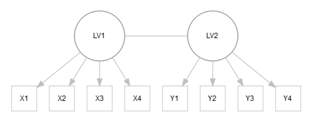

```{r setup, include=FALSE}
knitr::opts_chunk$set(echo = TRUE, comment=NA, cache=F, message = F, warning=F, 
                      R.options=list(width=120), fig.align='center')
library(tidyverse)
```


# Starting Out

## Document

[m-clark.github.io/docs/sem](https://m-clark.github.io/docs/sem)


## Data Etc.

[m-clark.github.io/docs/sem/sem_workshop.zip](m-clark.github.io/docs/sem/sem_workshop.zip)

Steps:

- Download
- Unzip
- Open RStudio
- File/Open Project...
- Click on SEM.Rproj
- File/Open/readMe.md

## Exercises

For exercises, open the exercises_nb.nb.html 

***with your browser!***

Or go to: 

[m-clark.github.io/docs/sem/exercises/exercises_nb.nb.html](http://m-clark.github.io/docs/sem/exercises/exercises_nb.nb.html)


## Outline

<p class='fragment emph'> Preliminaries</p>
<p class='fragment emph'> Graphical Modeling</p>
<p class='fragment emph'> Latent Variables</p>
<p class='fragment emph'> SEM</p>
<p class='fragment emph'> Overview of others</p>

## Goal

Give a broad overview of techniques related to SEM

Note connection to others

Be clear on limitations


#   {data-background="../../img/rstudio.png"}


##  {.col2}

Primary components

<p class='fragment emph'>Scripts/Docs</p>
<p class='fragment emph'>Console</p>
<p class='fragment emph'>Viewer</p>
<p class='fragment emph'>Other</p>

<br><br><br><br>


## Scripts/Docs

For this workshop, use traditional R script or notebook

Script is where your code goes

Ctrl+Enter will run current line or selected lines


## Console

Where the code is run

Typically your output will be viewed here

Avoid using directly


## Viewer

Visualizations

Other HTML

## Other

RStudio tries to make things easier

- Keyboard shortcuts
- Auto-complete

<span class='fragment emph'>Let it!</span>


# Intro2R

## Basics

Objects, Functions

Classes

Installing packages


## Code

Using functions to create output

Print the object to view it

```{r eval=F}
myobj = function(arg1=input1, argA=inputA)  
myobj
```

## Code

- The following creates the object <span class="objclass">nums</span>

- <span class="func">sum</span> sums the elements of <span class="objclass">nums</span>

- The result is <span class="emph">assigned</span> to the object <span class="objclass">numsSum</span>

- Object is printed to view it

```{r}
nums = c(1,2,3,4)      # c is a function that combines its elements
class(nums)
numsSum = sum(nums)     
numsSum
```


## Example lavaan code

```{r eval=FALSE}
library(lavaan)                     # loads the library

myModel = "
 # latent variables aka measurment models
 Factor1 =~ x1 + x2 + x3            
 Factor2 =~ y1 + y2 + y3

 # regresssions aka structural model
 Factor2 ~ Factor1 + z1 + z3
"

mySEM = sem(myModel, otherinputs)   # run the model
summary(mySem)                      # display results
```


## Save your work

Always save your scripts

If desired, can save your work as RData file


```{r eval=F}
save(obj1, obj2, file='filelocation/myRstuff.RData')

save.image('filelocation/myRstuff.RData')     # saves everything
```

# Graphical Models

##

```{r echo=FALSE, fig.width=5, fig.height=5, fig.align='center', dev='svg'}
mcclelland = haven::read_dta('../data/path_analysis_data.dta')
mcclellandNoCollege = select(mcclelland, -college, -college_missing) %>% 
  na.omit %>% 
  sapply(as.numeric) %>% 
  data.frame
blacklist = data.frame(from = c(rep(c('read21', 'math21'), each=7), rep(c('read7','math7'), each=5),
                                rep(c('vocab4', 'attention4'), each=3),
                                rep(c('adopted',  'male', 'momed'), times=2),
                                'math21','read21', 'math7','read7'),
                       to = c(rep(c('read7', 'math7', 'attention4', 'vocab4', 'adopted',  'male', 'momed'), times=2),
                              rep(c('attention4', 'vocab4', 'adopted',  'male', 'momed'), times=2),
                              rep(c('adopted',  'male', 'momed'), times=2),
                              c('male',  'momed', 'adopted'), c('momed',  'adopted', 'male'),
                              'read21', 'math21','read7','math7'))

library(bnlearn)
model = gs(mcclellandNoCollege, blacklist = blacklist, test='mi-g-sh')  

library(visNetwork); library(igraph)
g = graph_from_edgelist(model$arcs)
g = toVisNetworkData(g)
# there is no way to use circle without the label fucking the size up
visNetwork(nodes=data.frame(g$nodes, value=100), edges=g$edges, width='75%') %>% 
  visNodes(shadow=list(enabled=T, color='rgba(0,0,0,0.25)'),
           font=list(size=12, color='#fff'),
           shape='circle', 
           scaling=list(label=list(enabled=T, min=10, max=12), max=5),  
           color=list(background='#ff5503', highlight=list(background='salmon'))) %>% 
  visEdges(color='#1e90ff', arrows='to', smooth=list(enabled=T, forceDirection='horizontal')) %>% 
  visLayout(randomSeed=123)

```


## Overview

<p class='fragment emph'>Directed Graphs</p>
- <p class='emph'>Path Analysis</p>
- <p class='emph'>Mediation</p>
- <p class='emph'>Bayesian Networks</p>

<p class='fragment emph'>Undirected</p>
- <p class='emph'>Network analysis</p>


## Graphical Models

<p class='emph' style="font-size:150%">Nodes, vertices</p>
<p class='fragment' style="font-size:100%">May define variables, observations, concepts</p>

<p class='emph' style="font-size:150%">Edges, links</p>
<p class='fragment' style="font-size:100%">Define connections, relations</p>

<p class='emph' style="font-size:150%">Directed, Undirected, Mixed </p>


## Path analysis

Extends regression to:

- <p class='fragmentsmall emph'>Multiple targets</p>
- <p class='fragmentsmall emph'>Indirect effects</p>


## Multiple targets

Does not require SEM

Common in some areas:

- traditional 'multivariate' models
- zero-inflated models
- one-deck encoding


## Indirect effects

<span class='emph'>$A \rightarrow B \rightarrow C$</span>
<p class='fragment'>Indirect effects</p>
<p class='fragment'>Still may include direct path</p>
<p class='fragment'>*Always* more complicated than three variables</p>

## Issues in mediation

<p class='fragmentsmall'>Very difficult to justify in cross-sectional setting</p>
<p class='fragmentsmall'>Strong causal implications</p>
<p class='fragmentsmall'>Does not prove a causal relationship</p>

## Other techniques

Bayesian Networks

Network Analysis


# Latent Variables


##




```{r echo=FALSE, eval=FALSE}
library(htmltools)
# tags$div(style="width:500px; height:500px; margin-left:auto;  margin-right:auto",
         DiagrammeR::DiagrammeR('scripts/faVisual.gv', type='grViz', width='500px', height='500px')
# )
```


## Uses of latent variables

<p class='fragment emph'>Data Compression</p>

<p class='fragment emph'>Measurement of Latent Constructs</p>

<p class='fragment emph'>Other</p>


## Data compression

Take many things and produce few

Might focus on variance (e.g. PCA) or covariance (FA)

Use estimated scores in other analysis


## Measurement of Constructs

Underlying causal model

$$ x =  \lambda \textrm{F} + \epsilon $$

$$ \epsilon = \textrm{systematic + measurement error} $$

## Examples

Psychological constructs

Scholastic abilities

Topics in text


## Issues

Number of factors

Loadings, interpretation

Scale development, reliability


# Structural Equation Modeling


## SEM


## Putting it all together {data-transition="none-out"}

<div class='fragment emph' style="text-align:center">Measurement model</div>

<div class='fragment emph' style="text-align:center font-size:200%">\+</div>

<div class='fragment emph' style="text-align:center">Structural model</div>


## Putting it all together {data-transition='none-in'}

<div class='fragment emph' style="text-align:center">Factor Analysis</div>

<div class='fragment emph' style="text-align:center font-size:200%">\+</div>

<div class='fragment emph' style="text-align:center">Regression</div>


## Issues

Many, including:

- <p class='emph'>How to assess fit</p>
- <p class='emph'>Identification</p>
- <p class='emph'>Estimation techniques</p>
- <p class='emph'>Model complexity</p>
- <p class='emph'>Sample Size</p>

## How to fool yourself

- <p class='emph'>Too little data</p>
- <p class='emph'>'Poor' data</p>
- <p class='emph'>Ignoring performance, diagnostics</p>

## Other SEM

Latent Classes

Growth Curves

Multi-sample


## Reasons NOT to do SEM  {data-transition=fade}

<p class='fragment emph' style='text-align:center; font-size:150%'>Because it sounds cool</p>


## Reasons NOT to do SEM {data-transition=fade}

<p class='fragment emph' style='text-align:center; font-size:150%'>Because you see it in a paper</p>


## Reasons NOT to do SEM {data-transition=fade}

<p class='fragment emph' style='text-align:center; font-size:150%'>Because you can't get a large sample</p>


## Reasons to DO SEM{data-transition=fade}

<p class='fragment emph' style='text-align:center; font-size:150%'>It's can answer your specific research question better than alternatives</p>

## Reasons to DO SEM{data-transition=fade}

<p class='fragment emph' style='text-align:center; font-size:150%'>Very strong result if it works</p>


## Reasons to DO SEM{data-transition=none}

<p class='fragment emph' style='text-align:center; font-size:150%'>Measurement is of focus</p>


## Reasons to DO SEM{data-transition=none}

<p class='fragment emph' style='text-align:center; font-size:150%'>Ties to causal thinking</p>


## Reasons to DO SEM{data-transition=none}

<p class='fragment emph' style='text-align:center; font-size:150%'>Flexibility with Complexity</p>


# SEM requires hard thinking!

# Good luck!

